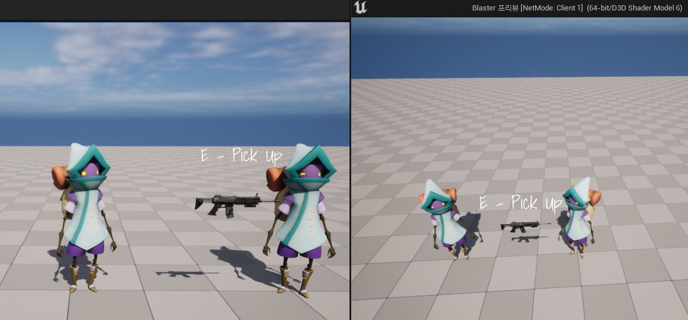
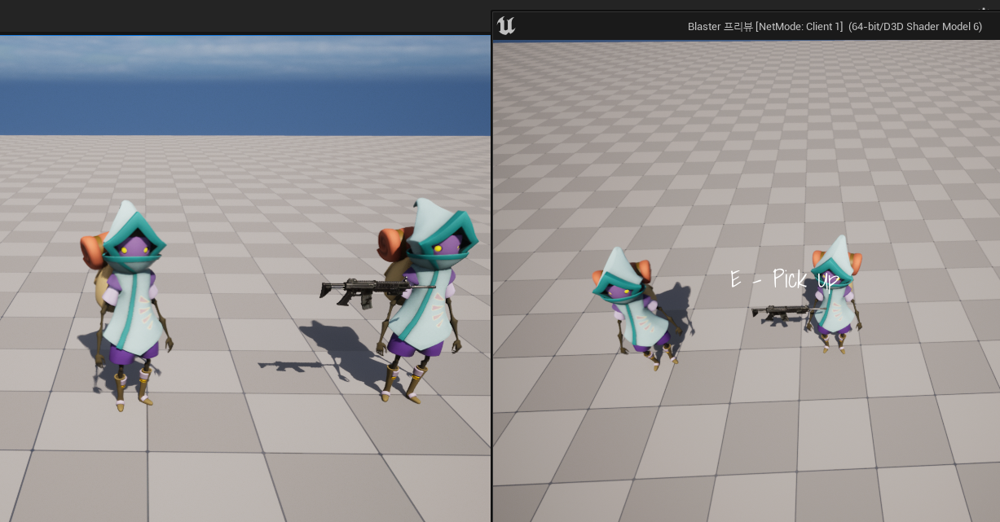

**Replication**
=========

<center></center>


* 좌측은 서버, 우측은 클라이언트

* 클라이언트 캐릭터가 무기에 부딪힌 상황

-------------

```c++
void AWeapon::BeginPlay()
{
	Super::BeginPlay();

    // OnSphereOverlap : 부딪히면 Text가 보이게 설정하는 함수
	AreaSphere->OnComponentBeginOverlap.AddDynamic(this, &AWeapon::OnSphereOverlap);
}
```

* 충돌할 때 Widget을 보이게 설정한 후, 클라이언트에서만 캐릭터가 충돌했지만 서버(에디터)까지 텍스트가 보여버린다

* 서버에서도 보이는 이유는 서버에서 Overlap Event가 발생하기 때문이다.


* 클라이언트로 변수를 복제해서 클라이언트에서만 보이게 하려면 다음과 같은 과정을 거쳐야 한다.

<br>

**과정**
----------------

* 첫 번쨰로, `UPROPERTY의 Replicated 속성이 들어가야 한다.`
* Replicated속성은 엔진에 의해 관리되고 복제되어야 함을 지정하는 역할
* `ReplicatedUsing으로 함수를 세팅하면 해당 변수가 복제될 때마다 세팅한 함수가 호출`된다.

```c++
UPROPERTY(ReplicatedUsing = OnRep_OverlaapingWeapon)
class AWeapon* OverlappingWeapon;

UFUNCTION()
void OnRep_OverlappingWeapon();

// c++
void ABlasterCharacter::OnRep_OverlappingWeapon()
{
	if(OverlappingWeapon)
	{
		OverlappingWeapon->ShowPickupWidget(true);
	}
}
```

* 두 번쨰로, `생성자에 bReplicated값을 true로 설정해야 함`
`
```c++
AWeapon::AWeapon()
{
	PrimaryActorTick.bCanEverTick = false;
	// bReplicates 값이 true여야만 다른 machine에서 복사될 수 있음  
	bReplicates = true;

    ...
}
```

* 세 번째로, `가상함수 GetLifetimeReplicatedProps에서 복제할 변수를 등록해야 한다`
* 변수를 등록하여 네트워크 상에서 자동으로 동기화한다.

```c++
// 네트워크 상에서 복제되어야 하는 프로퍼티 목록을 엔진에 알려주는 역할
void ABlasterCharacter::GetLifetimeReplicatedProps(TArray<FLifetimeProperty>& OutLifetimeProps) const
{
	Super::GetLifetimeReplicatedProps(OutLifetimeProps);

    // 기본적으로는 DOREPLIFETIME을 사용
    // DOREPLIFETIME(클래스, 변수)

	// COND_OwnerOnly : 해당 변수가 소유자만 접근 가능하도록 지정
	DOREPLIFETIME_CONDITION(ABlasterCharacter,OverlappingWeapon,COND_OwnerOnly);
}
```

<br>

**복제 후**
===============


<center></center>

* 서버에서 보이지 않고 클라이언트에서만 위젯이 보이게 되었다.

* 그런데 이러면 문제가 있는데 서버에서 접근하면 OnRep_OverlappingWeapon함수가 호출되지 않아 아무 반응이 없어 위젯이 뜨지 않는다.
  * 서버에서는 처음 시작할때 생성되기 때문에 복제되지 않아 함수가 호출되지 않음

* 그래서 따로 함수로 적용시켜야 한다.

```c++
// 이전
void ABlasterCharacter::SetOverlappingWeapon(AWeapon* Weapon)
{
	OverlappingWeapon = Weapon;
}

// 이후
void ABlasterCharacter::SetOverlappingWeapon(AWeapon* Weapon)
{
    // 처음에 false로 설정
    if(OverlappingWeapon)
		OverlappingWeapon->ShowPickupWidget(false);

	OverlappingWeapon = Weapon;

    // 로컬에서 컨트롤하는 서버라면
	if(IsLocallyControlled())
		if(OverlappingWeapon)
			OverlappingWeapon->ShowPickupWidget(true);
}
```

<br>

**OnRep 함수의 매개변수**
===========

* OnRep 함수에 매개변수에는 복제한 타입의 포인터(AWeapon*)를 가질 수 있다.

* 이 매개변수가 의미하는 것은 `변수가 복제되기 이전 마지막 값`을 의미한다.

```c++
// 헤더파일
UFUNCTION()
void OnRep_OverlappingWeapon(AWeapon* LastWeapon);

// 소스파일
void ABlasterCharacter::OnRep_OverlappingWeapon(AWeapon* LastWeapon)
{
	if(OverlappingWeapon)
	{
		OverlappingWeapon->ShowPickupWidget(true);
	}

    if(LastWeapon)
    {
        LastWeapon->ShowPickupWidget(false);
    }
}
```

