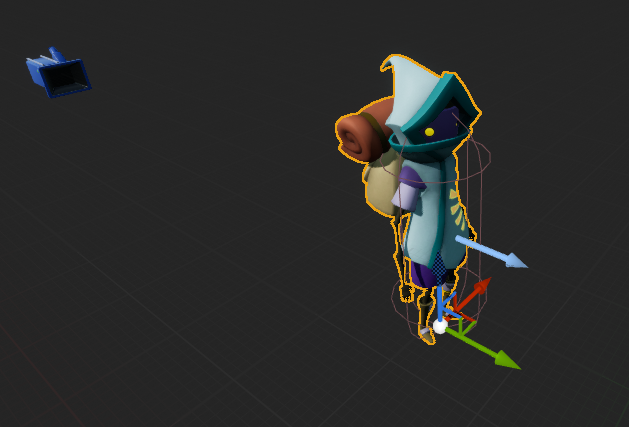
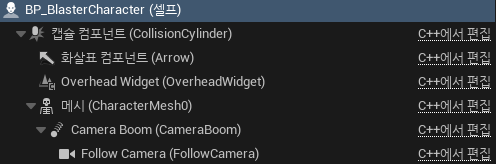
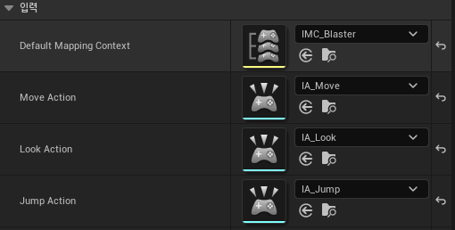
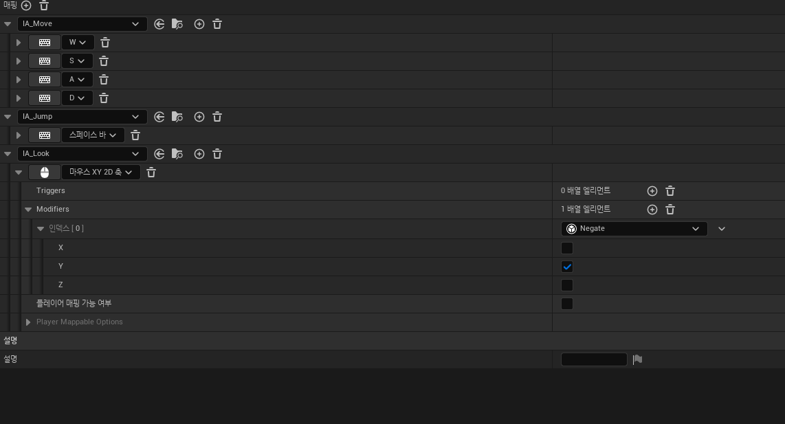
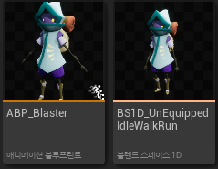
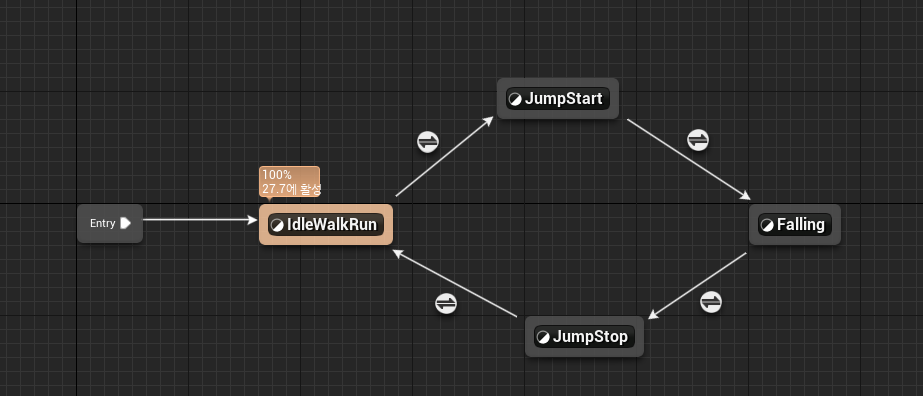
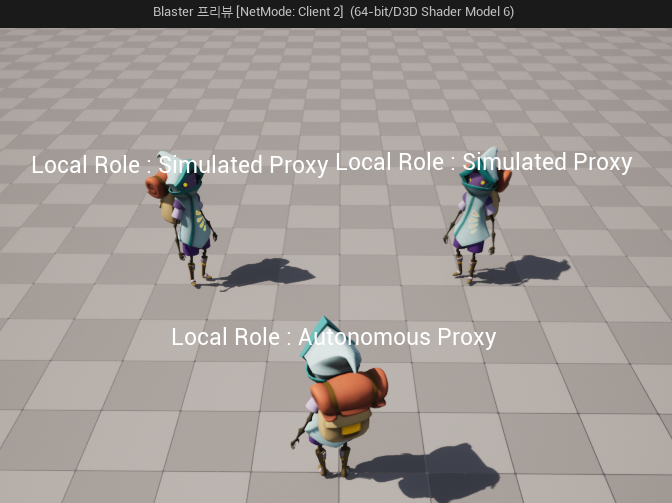

**캐릭터 생성**
============

* 캐릭터 생성하기
  * Unreal의 LearningKit 에셋 사용
  * 애니메이션은 LearningKit과 Mixamo 에셋을 이용한 리타게팅 이용

 

**카메라와 스프링암 추가**
============

 

**Input 추가**
===========

* InputContext와 InputAction을 캐릭터에 세팅

 

* InputContext 
  * Y축은 반대로 값을 받기위해 Negate와 Y축만 설정

 

**애니메이션 관련**
==========

* AnimationBlueprint와 BlendSpace1D 추가

 

* 애니메이션 그래프 설정

* AnimationInstnace 클래스를 따로 만듦

  * 여기서 GetCharacterMovement()->IsFalling() 함수로 공중에 있는지 체크

* `JumpStart -> Falling`은 `Automatic Rule Based on Sequence Player in State`를 체크하여 애니메이션이 끝날 때 자동으로 다음 애니메이션을 설정

* `JumpStop -> Idle`은 `Time Remaining(Ratio)` 노드를 이용하여 애니메이션 시간을 비율로 구해 0.1 아래에서 넘어가도록 세팅

 

**NetworkRole**
===========

* 멀티플레이어에서는 서버에 있는 캐릭터와 클라이언트에 있는 캐릭터 등 컴퓨터마다 다른 캐릭터가 있다.

* 어떤 캐릭터를 기준으로 할지를 **ENetRole**이라는 열거형으로 구분할 수 있다.

* C++코드에서 Text를 Bind한 위젯으로 구분함

 

**Local Role**
----------

* 액터가 존재하는 로컬 플레이어에 대한 역할을 정의한다.

* 서버

* 클라이언트

 

**Remote Role**
-------

*  네트워크 연결을 통해 원격 플레이어와 상호작용하는 액터(Actor)에 대한 역할을 정의한다.

* 서버

* 서버

