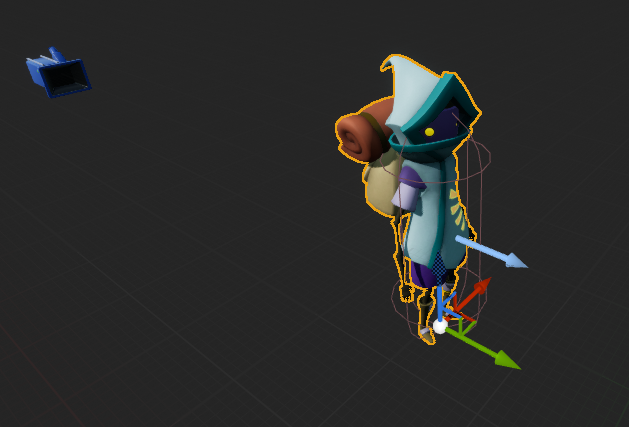
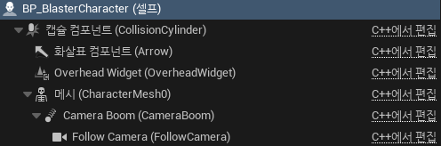
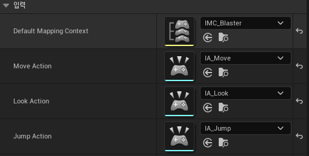
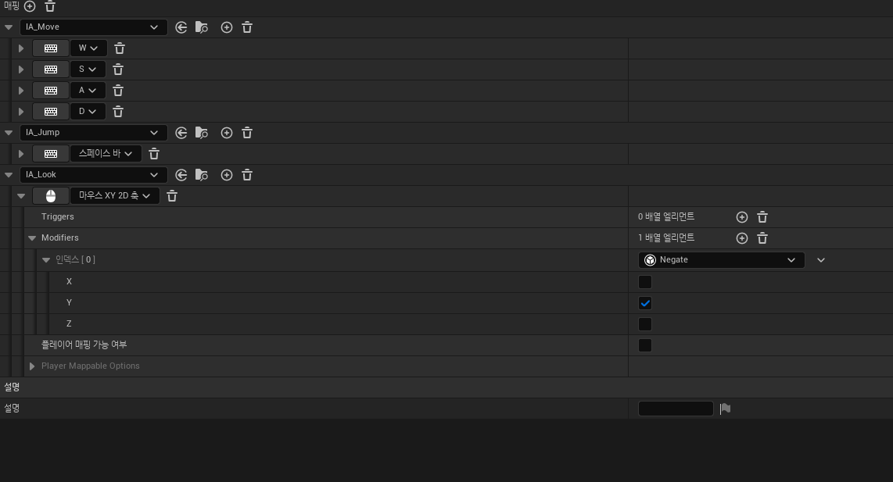
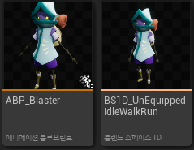
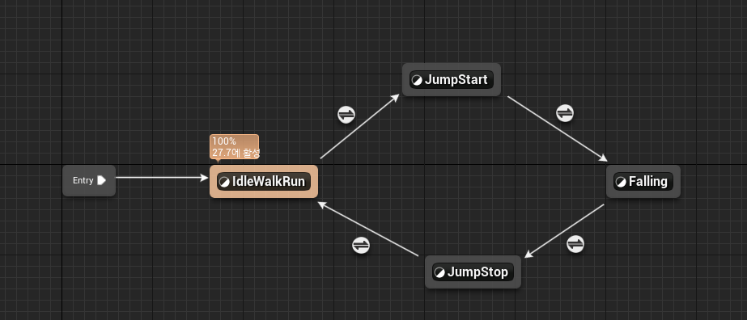

**캐릭터 생성**
============

* 캐릭터 생성하기
  * Unreal의 LearningKit 에셋 사용
  * 애니메이션은 LearningKit과 Mixamo 에셋을 이용한 리타게팅 이용

 

**카메라와 스프링암 추가**
============

 

**Input 추가**
===========

* InputContext와 InputAction을 캐릭터에 세팅

 

* InputContext 
  * Y축은 반대로 값을 받기위해 Negate와 Y축만 설정

 

**애니메이션 관련**
==========

* AnimationBlueprint와 BlendSpace1D 추가

 

* 애니메이션 그래프 설정

 

**NetworkRole**
===========

* 멀티플레이어에서 한 컴퓨터 안에 있는 캐릭터끼리 구분해서 서버인지 클라이언트인지를 구분할 수 있다.

* 어떤 캐릭터를 기준으로 할지를 `ENetRole`이라는 열거형으로 구분할 수 있다.

* Local은 자기 컴퓨터를 기준으로 Remote는 다른 컴퓨터를 기준으로 ENetRole를 부여한다고 생각하면 된다.

 

**간단한 ENetRole 설명**
============

* `ROLE_Authority` : 서버에 존재하는 액터

* `ROLE_SimulatedProxy` : 클라이언트에서 자기가 조종하지 않는 캐릭터를 의미

* `ROLE_AutonomousProxy` : 클라이언트에서 자기가 조종하는 캐릭터를 의미

* `ROLE_None` : 구분하지 않음

 

**Local Role**
====

* 로컬 플레이어에 대한 네트워크 역할을 정의한다.

### 서버

* 서버에서는 모든 Actor가 Authority를 가진다.

* Authority값을 가짐으로써 Server인지 Client인지 구분한다.

 

### 클라이언트

* 클라이언트에서 자기가 조종하는 캐릭터는 AutonomousProxy이다.

* 자기가 조종하지 않는 캐릭터는 SimulatedProxy이다.

 

**Remote Role**
======

*  네트워크 연결을 통해 원격 플레이어와 상호작용하는 액터(Actor)에 대한 역할을 정의한다.

* Remote Role은 서버에서는 클라이언트, 클라이언트에서는 서버의 ENetRole을 본다고 생각하면 된다.

 

### 서버

 

### 클라이언트

