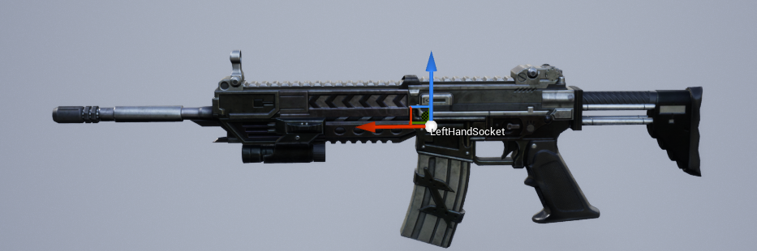
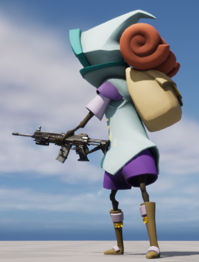

**무기 장착**
=========

* 소켓 설정

<center></center>

* Equip 함수


<center></center>


* 무기 장착

<center></center>


<br>

**애니메이션**
========

* 블렌드 스페이스

<center></center>

* 에임 오프셋

<center></center>


<br>

**멀티플레이어에서의 Pitch**
=========

* 멀티플레이어에서 Pitch값은 음수가 양수가 되어버린다.

* 그 이유는 다른 클라이언트한테 Pitch값을 네트워크 전송할 때 압축하면서 0~360도 사이로 바꾸기 때문

  * FRotator의 CompressAxisToShrot(float Angle) 함수

* `GetMappedRangeValueClamped 함수`를 이용하여 InRange값을 OutRange값에 Mapping하여 값을 변경할 수 있다.

```c++
void ABlasterCharacter::CalculateAO_Pitch()
{
	AO_Pitch = GetBaseAimRotation().Pitch;
	if (AO_Pitch > 90.f && !IsLocallyControlled())
	{
		// map pitch from [270, 360) to [-90, 0)
		FVector2D InRange(270.f, 360.f);
		FVector2D OutRange(-90.f, 0.f);
		AO_Pitch = FMath::GetMappedRangeValueClamped(InRange, OutRange, AO_Pitch);
	}
}
```

<br>

**FABRIK IK**
=========


* FABRIK AnimGraph
  

<center></center>


* FABRIK Detail

<center></center>

* End Effector 부분은 `체인의 말단 부분`으로, 타깃 위치와 회전을 결정한다.

* Solver 부분에서 사용할 본 체인을 Root 에서 Tip 까지 정의한다.
  * 팁이 엔드 이펙터 위치까지 도달하려 하는 부분

<br>

* 무기 Mesh의 LeftHandSocket

<center></center>

* 결과 

<center></center>

