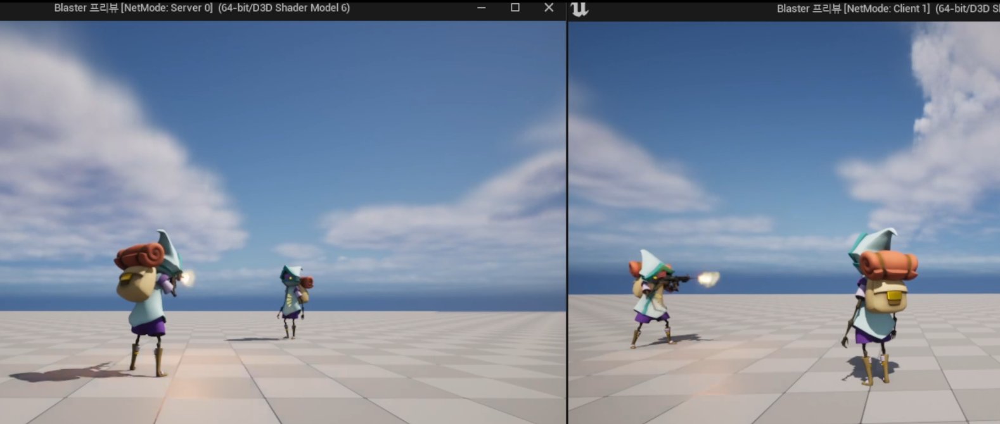

**Multiplayer Fire**
===========

* FireButtonPressed는 마우스 좌클릭했을 때 실행되는 함수

```c++
void UCombatComponent::FireButtonPressed(bool bPressed)
{
	bFireButtonPressed = bPressed;

	if(bFireButtonPressed)
	{
		ServerFire();	
	}
}
```

* 마우스 좌클릭이 눌렸을때 UFUNCTION(Server,Reliable) 속성을 갖고있는 ServerFire를 호출해도 다른 클라이언트에서는 애니메이션이 작동하지 않는다.
  * UFUNCTION(Server)은 클라이언트에서 호출하고 서버에서 실행되기 때문

* 그래서 bFireButtonPressed를 Replicated로 만드는 방법을 사용하려고 하는데 Replicated는 해당 변수가 변화가 있을 때만 작동하기 때문에 만약 계속 누르고 있는 상태라면 변수가 변하지 않아서 복제되지 않는다.

* 그렇기 때문에 클라이언트에게 알려야 하는 다른 방법을 사용해야한다.


### NetMulticast

* NetMulticast는 모든 컴퓨터에서 실행되는 속성이다

```c++
// 헤더파일
UFUNCTION(NetMulticast, Reliable)
void MulticastFire();

UFUNCTION(Server, Reliable)
void ServerFire();
```

```c++
// 소스코드
void UCombatComponent::FireButtonPressed(bool bPressed)
{
	bFireButtonPressed = bPressed;

	if(bFireButtonPressed)
	{
		ServerFire();	
	}
}

void UCombatComponent::ServerFire()
{
	MulticastFire();
}

void UCombatComponent::MulticastFire()
{
	Fire();	// 애니메이션 실행
}
```


* 이렇게 나뉘어져 있어야 서버와 모든 클라이언트에서 실행된다


<center></center>


<br>