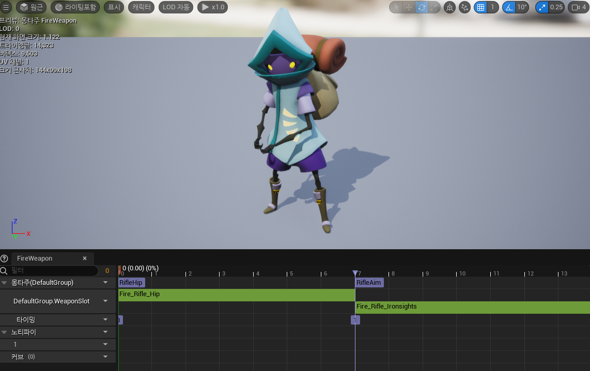
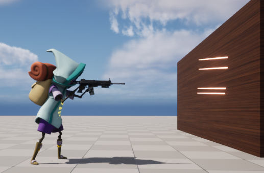
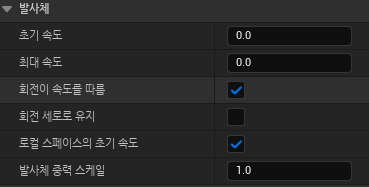
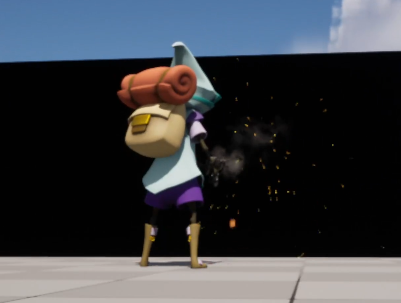

**Fire 종류**
========

* 총알을 발사시키는데 두 가지 방법이 있다

    * 하나는 `총알을 Actor로 만들어 Spawn 시키는 방법`

    * 다른 하나는 `LineTrace함수(HitScan)를 이용하여 충돌 체크하는 방법`

<br>

**Fire Monatge**	
==========

* 애니메이션 몽타주 추가


<center></center>

<br>


**LineTrace**
============

* 화면 중앙 위치부터 정면쪽 방향으로 LineTrace 함수를 이용하여 HitScan을 확인하는 함수

* 이 함수로 Spawn할 Projectile의 방향을 결정한다.

```c++
void UCombatComponent::TraceUnderCrosshairs(FHitResult& TraceHitResult)
{
	FVector2D ViewportSize;
	if (GEngine && GEngine->GameViewport)
	{
		// 뷰포트 구하기
		GEngine->GameViewport->GetViewportSize(ViewportSize);
	}

	// 화면상의 중앙 위치값 구하기
	FVector2D CrosshairLocation(ViewportSize.X / 2.f, ViewportSize.Y / 2.f);
	
	FVector CrosshairWorldPosition;
	FVector CrosshairWorldDirection;
	
	// UGameplayStatics::DeprojectScreenToWorld
	// Screen Space(2D)상의 값을 World Space(3D)에서의 위치와 방향값으로 바꾸는 함수 
	bool bScreenToWorld = UGameplayStatics::DeprojectScreenToWorld(
		UGameplayStatics::GetPlayerController(this, 0),
		CrosshairLocation,
		CrosshairWorldPosition,
		CrosshairWorldDirection
	);

	if (bScreenToWorld)
	{
		FVector Start = CrosshairWorldPosition;
		FVector End = Start + CrosshairWorldDirection * TRACE_LENGTH;

		// LineTraceSingleByChannel은 Start부터 End까지 선을 그어 해당 충돌 채널에 있는 
		// 오브젝트가 있으면 FHitResult타입을 참조로 하여 반환하는 함수
		GetWorld()->LineTraceSingleByChannel(
			TraceHitResult,
			Start,
			End,
			ECollisionChannel::ECC_Visibility
		);

		// HitTarget에 부딪힌 위치 저장
		if(!TraceHitResult.bBlockingHit)
		{
			// ImpactPoint는 부딪힌 위치
			TraceHitResult.ImpactPoint = End;
			HitTarget = End;
		}
		else // 부딪혔다면
		{
			HitTarget = TraceHitResult.ImpactPoint;
			DrawDebugSphere(
				GetWorld(),
				TraceHitResult.ImpactPoint,
				30.f,
				12,
				FColor::Red
				);
		}
	}
}
```

<br>


* 화면 중앙을 기준으로 LineTrace에 걸리는 곳에 Sphere 생성

<center></center>


**Spawning Projectile**
=========

* TSubClassOf로 Spawn시킬 타입을 저장

* 저장한 타입을 World->SpawnActor\<Type>의 형식으로 Spawn시킬 수 있다.

```c++
// TSubClassOf를 이용하여 템플릿(AProjectile) 타입 계열 클래스를 저장
UPROPERTY(EditAnywhere)
TSubclassOf<class AProjectile> ProjectileClass;
```

<br>

```c++
// 소스파일
void AProjectileWeapon::Fire(const FVector& HitTarget)
{
	Super::Fire(HitTarget);

	// InstigatorPawn는 데미지를 입힌 Pawn을 의미
	APawn* InstigatorPawn = Cast<APawn>(GetOwner());

	// 총구 소켓
	const USkeletalMeshSocket* MuzzleFlashSocket = 
		GetWeaponMesh()->GetSocketByName(FName("MuzzleFlash"));

	UWorld* World = GetWorld();
	if (MuzzleFlashSocket && World)
	{
		// 총구 소켓 Transform
		FTransform SocketTransform = MuzzleFlashSocket->GetSocketTransform(GetWeaponMesh());

		// LineTrace 함수를 이용하여 나온 위치값을 이용
		// 총구에서 HitTarget 방향을 구함(ToTarget)
		FVector ToTarget = HitTarget - SocketTransform.GetLocation();
		FRotator TargetRotation = ToTarget.Rotation();

		// FActorSpawnParameters는 SpawnActor 함수에서 사용하기 위해 정보를 모아놓은 구조체
		FActorSpawnParameters SpawnParams;
		SpawnParams.Owner = GetOwner();
		SpawnParams.Instigator = InstigatorPawn;

		// 
		World->SpawnActor<AProjectile>(
			ProjectileClass,
			SocketTransform.GetLocation(),
			TargetRotation,
			SpawnParams
		);
	}
}
```

<br>

<center></center>

<br>

**Projectile Movement**
============


* 언리얼에서는 투사체관련 움직임을 지원하는 컴포넌트가 있다.

* UProjectileMovementComponent를 추가해주면 해당 액터는 값에 맞게 움직인다. 

```c++
UPROPERTY(VisibleAnywhere)
class UProjectileMovementComponent* ProjectileMovementComponent;
```

<center></center>


<br>

**Shell**
==========

* 총 쏠때 탄약 떨어지게 구현

  * 캐릭터 오른쪽 다리 주황색

<center></center>


```c++
ACasing::ACasing()
{
	...

	// 중력,물리,충돌 등 가능하게 설정
	CasingMesh->SetSimulatePhysics(true);
	CasingMesh->SetEnableGravity(true);
	CasingMesh->SetNotifyRigidBodyCollision(true);
	ShellEjectionImpulse = 10.f;
}

void ACasing::BeginPlay()
{
	Super::BeginPlay()

	...

	// 해당 메쉬에 충격량
	CasingMesh->AddImpulse(GetActorForwardVector() * ShellEjectionImpulse);
}
```