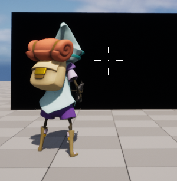
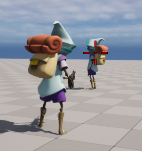

**크로스 헤어**
============

* DrawTexture를 통해 총 5개의 텍스쳐 (상,하,좌,우,중앙)을 화면에 띄우는 방식


```c++
// 텍스쳐 관련 구조체
USTRUCT(BlueprintType)
struct FHUDPackage
{
	GENERATED_BODY()

    // 크로스헤어에 사용할 텍스쳐 모음
	class UTexture2D* CrosshairsCenter; 
	UTexture2D* CrosshairsLeft;         
	UTexture2D* CrosshairsRight;        
	UTexture2D* CrosshairsTop;
	UTexture2D* CrosshairsBottom;

    // 각 텍스쳐가 이동하는  양
	float CrosshairSpread;

    // 텍스쳐 색상
	FLinearColor CrosshairsColor;
};
```

* 텍스쳐 그리는 함수인 DrawTexture를 이용

```c++
void ABlasterHUD::DrawCrosshair(UTexture2D* Texture, FVector2D ViewportCenter, FVector2D Spread, FLinearColor CrosshairColor)
{
    // 텍스쳐 크기
	const float TextureWidth = Texture->GetSizeX();
	const float TextureHeight = Texture->GetSizeY();

    // 텍스쳐가 그려질 위치
	const FVector2D TextureDrawPoint(
		ViewportCenter.X - (TextureWidth / 2.f) + Spread.X,
		ViewportCenter.Y - (TextureHeight / 2.f) + Spread.Y
	);

    // 텍스쳐 크기
	DrawTexture(
		Texture,                // 텍스쳐
		TextureDrawPoint.X,     // 시작위치(가로)
		TextureDrawPoint.Y,     // 시작위치(세로)
		TextureWidth,           // 가로크기
		TextureHeight,          // 세로크기
		0.f,                    // U
		0.f,                    // V
		1.f,                    // U 크기
		1.f,                    // V 크기
		CrosshairColor          // 색상
	);
}
```

<center></center>

**줌**
=========

```c++
void UCombatComponent::InterpFOV(float DeltaTime)
{
	...
    // 에임중이라면 보간 함수(FInterpTo)를 통해 에임중 FOV값으로 설정
	if (bAiming)
	{
		CurrentFOV = FMath::FInterpTo(CurrentFOV, EquippedWeapon->GetZoomedFOV(),DeltaTime,
         EquippedWeapon->GetZoomInterpSpeed());
	}
    // 에임이 아니라면 보간 함수(FInterpTo)를 통해 평상시 FOV값으로 설정
	else
	{
		CurrentFOV = FMath::FInterpTo(CurrentFOV, DefaultFOV,DeltaTime,
         ZoomInterpSpeed);
	}
	...
}
```


**크로스헤어 적 판별**
=============

```c++
// LineTrace
GetWorld()->LineTraceSingleByChannel(
    TraceHitResult,
    Start,
    End,
    ECollisionChannel::ECC_Visibility
);

// LineTrace의 결과값으로 나온 Actor가 적인지를 판별하기 위해
// 언리얼 인터페이스를 만들어 그 인터페이스를 상속시켜 Implements로
// 해당 인터페이스의 자식임을 확인하는 방법
if(TraceHitResult.GetActor() && TraceHitResult.GetActor()->Implements<UInteractWithCrosshairsInterface>())
{
    HUDPackage.CrosshairsColor = FLinearColor::Red;
}
else
{
    HUDPackage.CrosshairsColor = FLinearColor::White;
}
```


<center></center>

<br>

**Automatic Fire**
=============

* Timer를 사용하여 총 쏘는 간격 맞춤

```c++
void UCombatComponent::Fire()
{
	if(CanFire())
	{
		bCanFire = false;
        // UFUNCTION(Server,Reliable)
		ServerFire(HitTarget);

        // 총쏠때 크로스헤어 간격
		if (EquippedWeapon)
		{
			CrosshairShootingFactor = .75f;
		}
		StartFireTimer();
	}
}

void UCombatComponent::StartFireTimer()
{
	if (EquippedWeapon == nullptr || Character == nullptr) return;
	Character->GetWorldTimerManager().SetTimer(
		FireTimer,
		this,
		&UCombatComponent::FireTimerFinished,
		EquippedWeapon->FireDelay
	);
}

void UCombatComponent::FireTimerFinished()
{
	if (EquippedWeapon == nullptr) return;

	bCanFire = true;

    // 마우스 클릭을 누르고 있으며 해당 무기가 Automatic형식이면
	if (bFireButtonPressed && EquippedWeapon->bAutomatic)
	{
		Fire();    
	}
}
```
