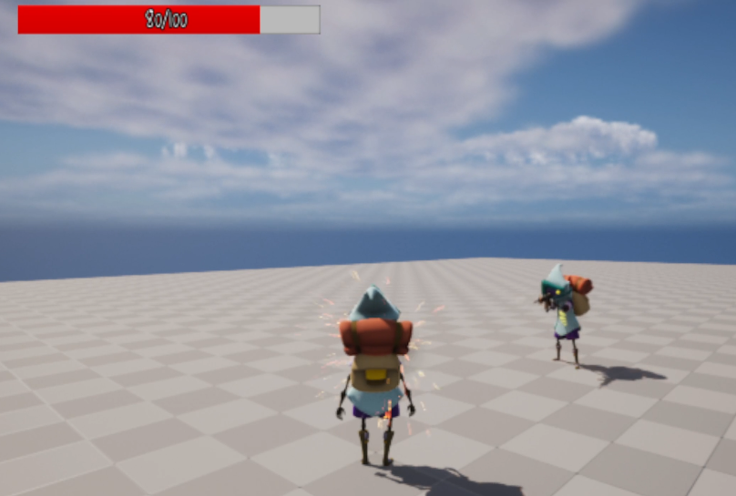
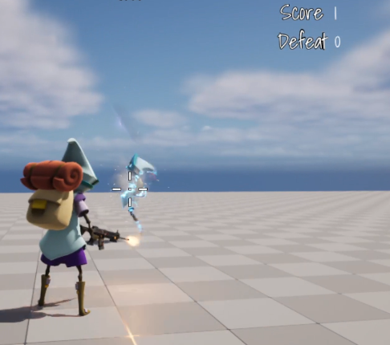
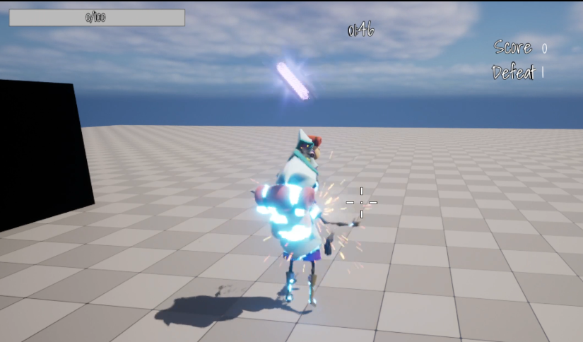

**Health**
============

* `UPROPERTY(meta = (BindWidget))`를 이용해서 C++과 연동

```c++
UCLASS()
class BLASTER_API UCharacterOverlay : public UUserWidget
{
	GENERATED_BODY()
public:
	UPROPERTY(meta = (BindWidget))
	class UProgressBar* HealthBar;

	UPROPERTY(meta = (BindWidget))
	class UTextBlock* HealthText;

    ...
};
```

**Damage**
=============

* 언리얼에서는 `OnTakeAnyDamage`라는 Delegate를 지원하여 해당 Actor가 공격을 맞았는지 판단할 수 있다.

* 반면에, 공격을 하는 Actor에서는 `ApplyDamage() 함수`를 이용하여 `OnTakeAnyDamage` Delegate를 사용하는 Actor에게 


```c++
// OnTakeAnyDamage Deleaget에서 사용하는 함수
void ABlasterCharacter::ReceiveDamage(AActor* DamagedActor,
float Damage,
const UDamageType* DamageType, 
AController* InstigatorController,
AActor* DamageCursor);

// 데미지를 `입는` Actor에서는 OnTakeAnyDamage를 이용
void ABlasterCharacter::BeginPlay()
{  
    ...

	if(HasAuthority())
	{
        // ReceiveDamage에서는 맞았을 때 행동
		OnTakeAnyDamage.AddDynamic(this,&ABlasterCharacter::ReceiveDamage);	
	}
}

// 데미지를 `주는` Actor에서는 UGameplayStatics::ApplyDamage() 함수를 이용
void AProjectileBullet::OnHit(UPrimitiveComponent* HitComp, AActor* OtherActor,
UPrimitiveComponent* OtherComp,	FVector NormalImpulse, const FHitResult& Hit)
{
    ABlasterCharacter* OwnerCharacter = Cast<ABlasterCharacter>(GetOwner());

	if (OwnerCharacter)
	{
		ABlasterPlayerController* OwnerController = 
                        Cast<ABlasterPlayerController>(OwnerCharacter->Controller);

		if (OwnerController)
			UGameplayStatics::ApplyDamage(
                OtherActor, Damage, OwnerController,
                    this, UDamageType::StaticClass());
	}
    Super::OnHit(HitComp, OtherActor, OtherComp, NormalImpulse, Hit);
}
```

<center></center>

<br>

**Dissolve Material**
==============

* 런타임에서 사용할 Dynamic Material과 Dynamic Material에 사용할 Material 변수 등록

```c++
// Dynamic instance that we can change at runtime
UPROPERTY(VisibleAnywhere, Category = Elim)
UMaterialInstanceDynamic* DynamicDissolveMaterialInstance;

// Material instance set on the Blueprint, used with the dynamic material instance
UPROPERTY(EditAnywhere, Category = Elim)
UMaterialInstance* DissolveMaterialInstance;
```

* `UMaterialInstanceDynamic::Create`로 Dynamic Material을 만들고 해당 Mesh에 Material을 설정
* `SetScalarParameterValue`를 통해 Material에서 사용하려는 값을 설정할 수 있다.

```c++
if (DissolveMaterialInstance)
{
    // Dynamic Material 생성
    DynamicDissolveMaterialInstance = UMaterialInstanceDynamic::
                                            Create(DissolveMaterialInstance, this);

    // 메쉬에 Material 등록
    GetMesh()->SetMaterial(0, DynamicDissolveMaterialInstance);

    // 초기 Material 상수값 설정
    DynamicDissolveMaterialInstance->
                SetScalarParameterValue(TEXT("Dissolve"), 0.55f);

    DynamicDissolveMaterialInstance->
                SetScalarParameterValue(TEXT("Glow"), 200.f);
}
StartDissolve();
```

* `StartDissolve() 함수`에서는 언리얼에서 지원하는 Curve를 이용하여 값을 실시간으로 변경할 수 있다.

```c++
// 헤더파일
UPROPERTY(VisibleAnywhere)
UTimelineComponent* DissolveTimeline;

FOnTimelineFloat DissolveTrack;

UPROPERTY(EditAnywhere)
UCurveFloat* DissolveCurve;


// 소스파일
void ABlasterCharacter::UpdateDissolveMaterial(float DissolveValue)
{
	if (DynamicDissolveMaterialInstance)
	{
        // Curve 노드에 따라 값을 런타임 중 실시간으로 변경
		DynamicDissolveMaterialInstance->
                    SetScalarParameterValue(TEXT("Dissolve"), DissolveValue);
	}
}

void ABlasterCharacter::StartDissolve()
{
    // 프레임마다 실행되는 Delegate 등록
	DissolveTrack.BindDynamic(this, &ABlasterCharacter::UpdateDissolveMaterial);

	if (DissolveCurve && DissolveTimeline)
	{
		DissolveTimeline->AddInterpFloat(DissolveCurve, DissolveTrack);
		DissolveTimeline->Play();
	}
}
```

<br>

**Elim Animation**
=============

* HP가 0이면 삭제되는 애니메이션 실행

* 죽인 컴퓨터에서의 Widget에서 Score 추가

* 죽을 때 Dissolve Material 실행

<center></center>


* 죽은 컴퓨터에서의 Widget에서는 Defeat 추가

<center></center>
