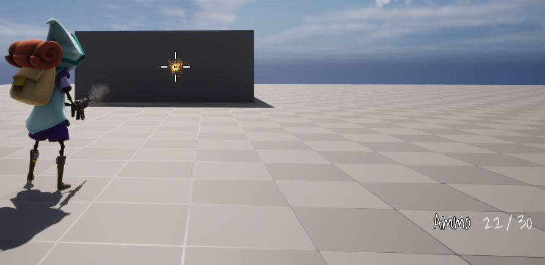
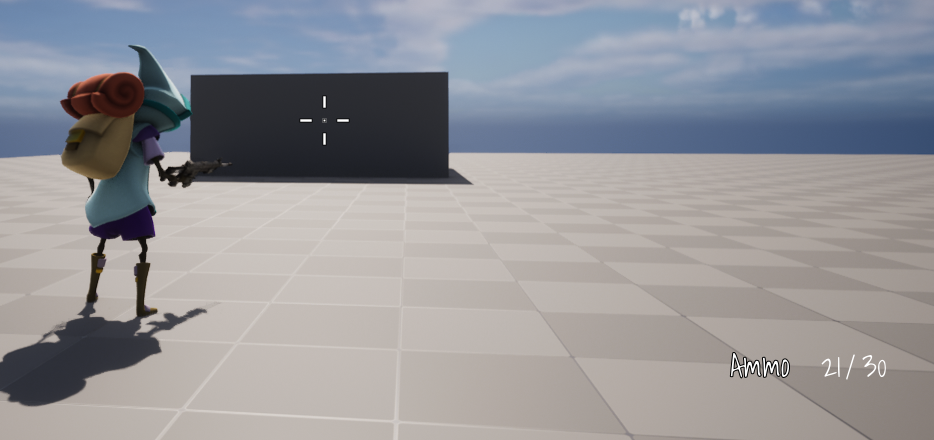
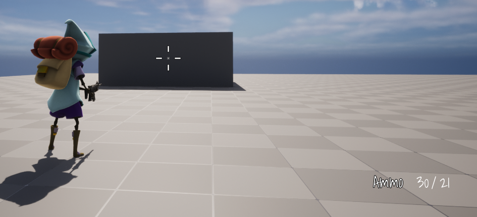

**Ammo**
==========

* 서버 캐릭터가 무기에서 총알을 쏘고나서 무기를 떨어뜨리면 해당 Ammo는 다른 클라이언트에서도 적용되어야 하기 때문에 UPROPERTY(Replicated) 를 사용한다.


<center></center>

**Reload**
=============

* ReloadAnimation은 Replicated된 변수를 사용해서 해당 변수가 변할 때 호출되는 OnRep 함수안에서 ECombatState를 이용하여 해당 타입에 맞는 함수를 호출하는 식으로 서버와 클라이언트에서 실행하게 만듦

* Reload 애니메이션이 끝나면 애니메이션 몽타주 노티파이를 사용하여 변수를 바꿔서 다시 OnRep 함수를 호출하는 식으로 사용

```c++
// 헤더 파일
UPROPERTY(ReplicatedUsing = OnRep_CombatState)
ECombatState CombatState = ECombatState::ECS_Unoccupied;

UFUNCTION()
void OnRep_CombatState();

// 소스 파일
void UCombatComponent::OnRep_CombatState()
{
	switch (CombatState)
    {
        ECS_Unoccupied UMETA(DisplayName = "Unoccupied"),
        HandleReload(); // ReloadAnimation 실행
        break;
        // 다른 State ...
    }
}
```

* 애니메이션 인스턴스 클래스

```c++
// AnimNotify_(Notify이름)을 사용하면
// C++에서 해당 노티파이에 이 함수를 호출할 수 있다.
UFUNCTION()
void AnimNotify_ReloadFinished();
```

* 몇발 쏜 후 Reload 애니메이션 실행

<center></center>


* 장전 후


<center></center>


<br>

-----------

* 장전수 매커니즘

* 채울수 있는 탄창수와 남아 있는 탄창수 중 더 적은 값을 추출하여 최대로 채울 수 있는 총알 수를 구함

```c++
// 최대 용량에서 현재 총알수를 뺀 값
// 즉, 채울 수 있는 총알수
int32 RoomInMag = EquippedWeapon->GetMagCapacity() - EquippedWeapon->GetAmmo();

if(CarriedAmmoMap.Contains(EquippedWeapon->GetWeaponType()))
{
    // Map에서 해당 WeaponType의 남은 총알수를 가져옴
    int32 AmountCarried = CarriedAmmoMap[EquippedWeapon->GetWeaponType()];
    // Min함수를 이용하여 더 적은 값을 추출
    int32 Least = FMath::Min(RoomInMag,AmountCarried);
    // Clamp를 이용하여 return
    return FMath::Clamp(RoomInMag,0,Least);
}
```