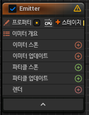

# **Niagara System**

* Niagara Emitter을 여러 개를 가질 수 있는 것

 

# **Niagara Emitter**

* World에 배치하거나 생성할 수 있는 emitter container

* 파티클을 생성하고 제어하는 역할

* `우클릭 -> FX -> 나이아가라 이미터` 를 통해서 만들 수 있고 생성하면 3종류가 있는데 처음 만들 때는 `빈 이미터 생성`을 클릭하여 생성한다.

 

# 기본설정

* 맨 위에서 시작하여 맨 아래까지 순서대로 실행되며 이 중 `렌더`를 먼저 설정해야 한다.

## **렌더러**

* 렌더러는 `스프라이트 렌더러, 메쉬 렌더러, 리본 렌더러` 총 3종류가 있다.

### 스프라이트 렌더러(Sprite Renderer)

* 스프라이트를 이용하여 파티클을 생성하는 방법

* 스프라이트(Sprite)는 2D 카메라가 보는 평면이고 이 평면은 언제나 카메라를 향하고 있다

### 메쉬 렌더러 (Mesh Renderer)

* 파티클을 Mesh 형태로 생성하는 방법

### 리본 렌더러(Ribborn Renderer)

* World에 존재하는 Actor같은 것에 붙어서 움직일 때 같이 파티클이 생성되는 방식

* 간단하게 사용해 보려면 Spawn Count를 늘리고 Particle Spawn에서 Ribborn Width Mode를 Direct Set으로 설정한 다음 너비를 조절한 다음, 캐릭터에게 붙여서 움직이면 된다.

 

## **이미터 업데이트**

* 총 4가지가 있고 순서대로 살펴본다.

* 여기서 Spawn은 BeginPlay, Update는 Event Tick과 비슷한 역할이다.

### 이미터 스폰(Emitter Spawn)

* 이미터가 시작되는 스테이지이며 보통 몇가지 속성을 사용할 순 있지만 잘 사용되지는 않는다.

### 이미터 업데이트(Emitter Update)

* 여기서 파티클의 수를 지정할 수 있다

* 자주 사용하는 3가지 모듈이 있는데 이 모듈을 통해서 파티클이 어떻게 생성할 지를 결정할 수 있다.

### 파티클 스폰(Particle Spawn)

* `크기(Size)/ 위치(Location) / 색깔(Color)`을 조절하고 `수명(Life time)`또한 조절한다.

### 파티클 업데이트(Particle Update)

* `움직임(Movement)/ 스케일링(Tick마다 크기가 바뀌는) / Fading(점점 사라지거나 선명해지는)`을 조절한다.
