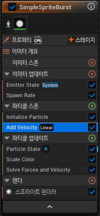
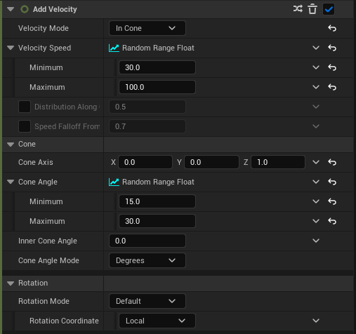

# Add Velocity

* 파티클에 속도를 추가하는 모듈

* Particle Spawn에서 추가할 수 있다

## Detail

### Velocity Mode

* `Linear` : X,Y,Z축 값을 조절해서 원하는 방향으로 설정이 가능하다

* `From Point` : 점(Point)을 기준으로 Random 방향으로 퍼져나감

* `In Cone` : 꼬깔(Cone) 모양으로 퍼져나감

### Velocity Speed Scale

* 속력을 지정해주는 값

### Rotation 

* Rotation Mode로 `Default, Axis Angle, Yaw/Pitch/Roll, Quaternion, Matrx, None` 까지 지원한다.
