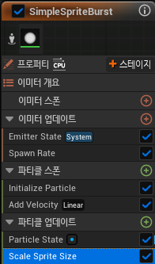
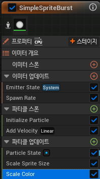
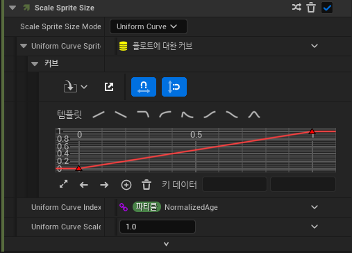

# Scale Sprite Size 

* 시간이 지남에 따라 Particle의 크기를 조절하는 모듈

* Particle Update에서 추가할 수 있다.

* 보통 Curve를 이용하여 눈으로 쉽게 조절할 수 있다.

 

# Scale Color

* 시간이 지남에 따라 Particle의 색깔을 조절하는 모듈

* Particle Update에서 추가할 수 있다.

* 보통 Curve를 이용하여 눈으로 쉽게 조절할 수 있다.

 

# Curve

* 여러 모듈에서 사용할 수 있는 기능으로, 위 그래프처럼 시간(가로)에 따라 값(세로)이 적용시킬 수 있다.

* `Uniform Curve Index`에서 `Random Range ~~`를 이용해서 `Min ~ Max 사이의 랜덤 값`을 적용시킬 수도 있다.