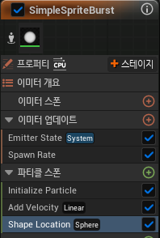
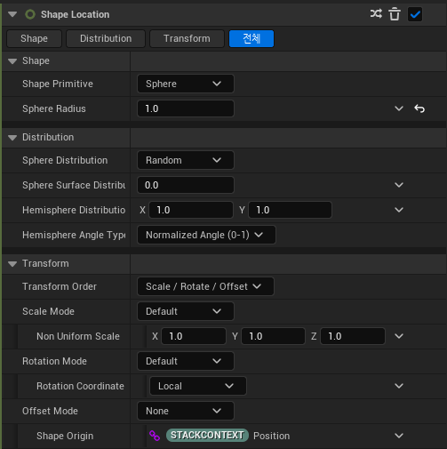

# Shape Location

* 파티클의 위치를 조절해주는 모듈

* Particle Spawn에서 추가할 수 있다
  

# Detail

### Shape Primitive

* 파티클이 생성되는 위치는 Shape 모양을 기준으로 지정한다

* 종류에는 `Sphere(구), Cylinder(원기둥), Box/Plane(박스,평면), Torus(원환면,도넛모양), Ring/Disc(반지), Cone(꼬깔)`이 있다.

* 종류를 고르면 Radius(반지름)이나 Height(높이)를 지정하여 범위를 지정한다

### Distribution(분포도)

* Shape에 따라 값이 다르지만 대개로 Mode에서 `Random`으로 무작위로 사용하거나 `Direct`를 고르고 값을 설정해서 원하는 모양으로 할 수 있다

### Transform

* `Scale,Rotation,Offset`등이 있고 실제 Level에서 배치될 때 유용하다.

  * X축이든 Y축이든 바라보고 싶게할 때 Rotation을 이용