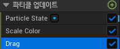

# Curl Noise Force

* `파티클에게 힘을 무작위성으로 부여하고 싶을 때 사용하는 모듈`

* Particle Update에서 추가할 수 있다.

## Detail

### Noise Strength

* 무작위성의 강도를 조절하는 값

### Noise Frequency

* Noise에 따라 무작위성이 정해져서 결국 해당 값에 따른 무작위성이 발생한다

* 그래서 Noise값을 바꿔서 다른 무작위성을 바꿀 수 있다. 

 

# Drag

* `파티클의 속도를 줄여줄 때 사용하는 모듈`

* Particle Update에서 추가할 수 있다.

## Detail

### Drag

* 속도를 줄일 힘을 조절하는 값

### Rotational Drag

* 회전 속도를 줄일 힘을 조절하는 값

 

# Vortex Velocity

* Detail에 있는 `Axis(축)을 기준으로 회전시키는 모듈`

* Particle Update에서 추가할 수 있다.

## Detail

### Velocity Amount

* 회전하는 힘을 조절하는 값

### Vortex Axis

* X,Y,Z축은 Roll/Pitch/Yaw 처럼 해당 축을 기준으로 회전한다

 

# Wind Force

* `부가적인 공기 저항(Air Resistance) 파라미터와 함께 바람 힘을 적용시킬 수 있는 모듈`
파티클이 바람 방향으로 풍속보다 빠르게 움직이는 경우에는 추가적인 힘이 가해지지 않는다.

## Detail

### Wind

* Wind Speed : 바람의 방향을 정하는 값

* Wind Speed Scale : 바람의 힘을 정하는 값

### Turbulence(난기류)
