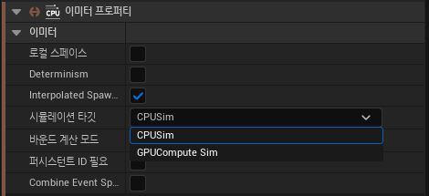

# Graphic Sprite

* `Sprite는` 이전에도 설명했듯이, `카메라를 향하는 평면`이다.

* 파티클은 CPU Sprite을 사용하는데 GPU Sprite와 CPU Sprite의 차이는 어떤 거로 처리하냐의 차이일 뿐이다.

* 하지만 GPU를 사용하면 많은 수의 파티클을 처리하는데는 CPU보다 효율적이다.

* 그렇다고 특정 모델은 CPU Sprite를 사용하는 것이 더 효율적일 수 있으니 상황에 따라 선택해야 한다.

 

# Detail

* `프로퍼티`에서 설정이 가능하며 GPU인지 CPU인지는 Detail에서 설정이 가능하다.