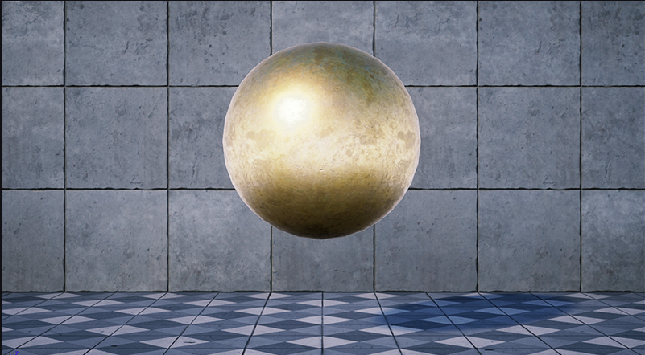
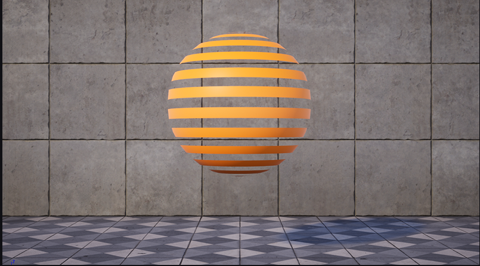
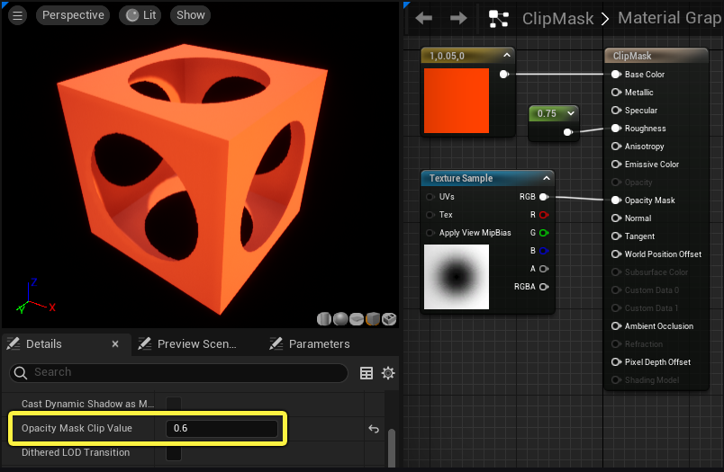
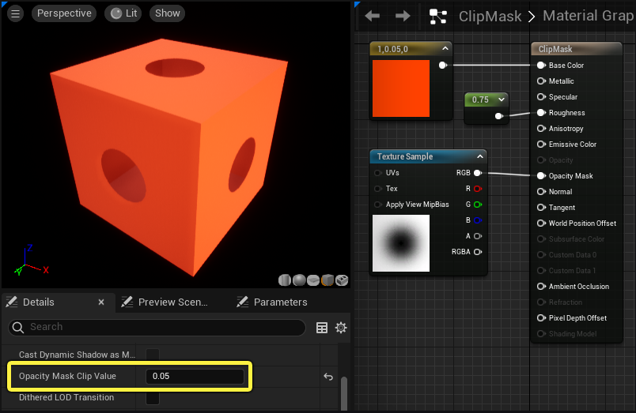
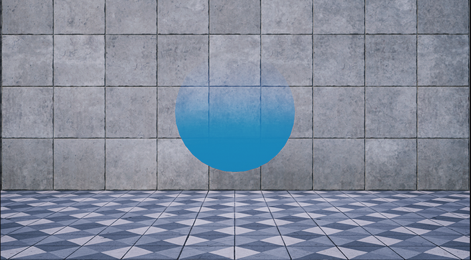
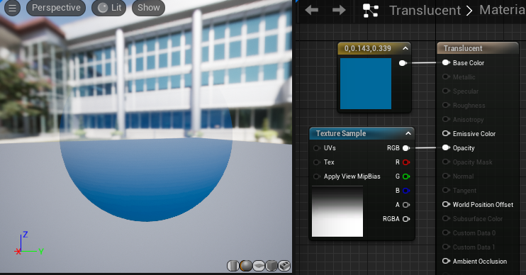
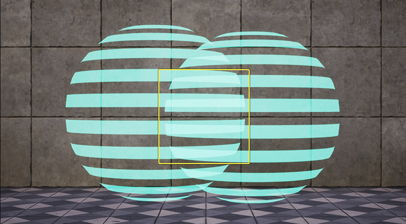
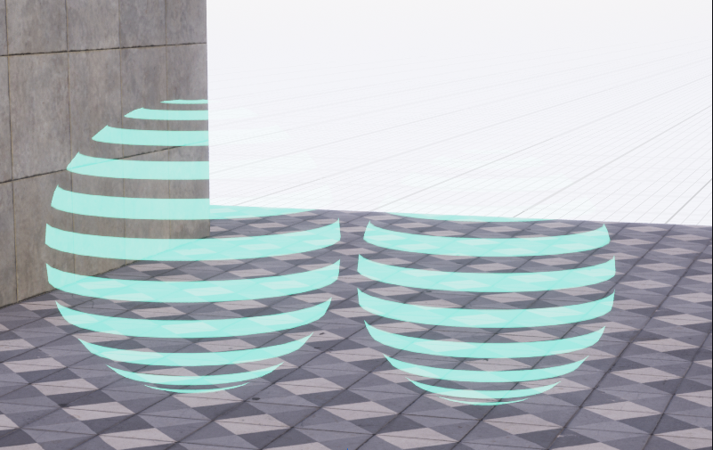
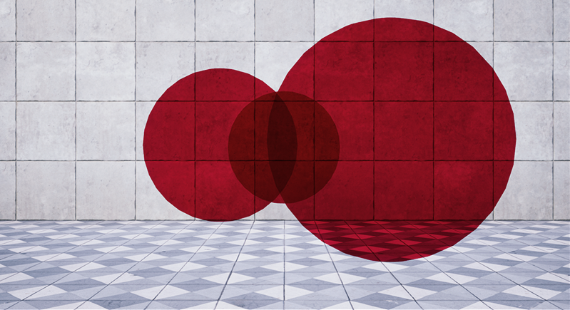

* Blend Mode는 `이 Material을 다른 픽셀 앞에 렌더링할 때, 엔진에서 이 Material( 소스 컬러 )과 이미 프레임 버퍼에 있는 것( 대상 컬러 )을 결합하는 방식을 조절하는 방식`

# 종류

* Detail부분에 있으며 다음과 같이 있다.

## **Opaque(불투명)**

* `빛이 통과하지도, 투과되지도 않는 표면을 정의`. 즉, 뒤가 보이지 않음

* 플라스틱, 금속, 돌, 그리고 기타 표면 유형 대부분에 적합

## **Masked**

* `가시성을 켜기와 끄기 둘 중에서 선택적으로 제어해야 할 때 사용`

* 쇠창살 같은 거를 생각해보면 중간 중간 뚫려 있어 뒤에가 보이는데 이럴 때 Maksed를 사용

* Maksed 모드는 컬링된 픽셀을 그리지 않아서 리플렉션(Reflection)이 전혀 보이지 않는다.

* Specular나 Reflection을 유지하고 싶다면 Translucent(반투명)을 사용해야 한다.

### 오파시티 마스크 클립 값(Opacity Mask Clip Value) 

* 이 값에 따라 가시성을 조절할 수 있다.

* 이 프로퍼티 값에는 0~1의 Scalar 값으로 사용되고 그 이상의 어두운 픽셀은 렌더링되지 않는다

* 이 사진은 양면(Two Side) 프로퍼티가 True로 설정되어 있어 박스 안도 볼 수 있다.

 

## **Translucent(반투명)**

* `일정한 형태의 투명도가 필요한 오브젝트에 사용한다`.

  * 투명도 수준을 조절할 수 있다는 점에서 Maksed와 다르다

* `오파시티(Opacity) 값이나 텍스처를 받은 다음, 검은색 영역은 완전히 투명하게, 흰색 영역은 완전히 불투명하게, 그리고 그 중간의 다양한 그러데이션 값은 그에 상응하는 투명도를 구현하는 방식으로 표면에 적용`

* Translucent Material을 사용할 때 중요한 고려사항은 반투명 머티리얼이 스페큘러 효과를 지원하지 않는다는 것이다.

  * 표면에 Reflection이 보이지 않는다는 뜻

## **Additive**

* `단순히 머티리얼의 픽셀을 취해서 배경의 픽셀에 더하는 것`

* Additive는 픽셀에 더하는 것이기 때문에 겹쳐진 부분이 더 밝아지는 것을 사진에서 알 수 있다.

* `어두워지지 않는다는 뜻으로, 모든 픽셀 값을 더하기 때문에 검은색은 투명하게만 렌더링된다.`

* 불, 증기, 홀로그램과 같은 다양한 특수 효과에 좋다.

* Translucent처럼 스페큘러 효과(리플렉션)를 반영하지 않는다

 

### 단점

* 밝은 색의 배경에서는 잘 보이지 않을 수 있다.

## **Modulate**

* `머티리얼의 값에 배경의 픽셀 값을 곱한다`

* 어두워지는 이펙트를 구현할 때 사용한다.

* Emissive Color로 표면 컬러를 정의한다

## **AlphaComposite**

* `알파를 미리 곱한 텍스처를 가진 머티리얼에서 사용된다`

  * 이미지가 저장되기 전에 RGB 컬러 채널이 알파 채널에 미리 곱해진다는 것을 의미한다.

* 밝은 컬러의 파티클 및 VFX에 Additive 또는 Translucent 대신 유용하게 사용할 수 있다.

* Additive와 비교하면 가시성이 더 높고, 밝은 색의 배경에서 더 높은 컬러 채도를 유지한다.

 

## **AlphaHoldout**

*  스페이스에서 머티리얼의 알파를 '유지'하여 오브젝트를 통과해 바로 뒤에 구멍을 만드는 방식

 

# 알아두면 좋은점

* Additive의 Emissive Color값이 0이 되는 부분은 투명해지지만, Translucent의 Emissive Color값이 0이 되는 부분은 어두워진다.

* 이를 이용하여 배경을 어둡게 할지 투명하게 할지 적용할 수 있다.

# 공식문서
* <https://dev.epicgames.com/documentation/ko-kr/unreal-engine/material-blend-modes-in-unreal-engine>