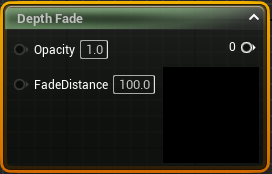
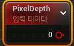
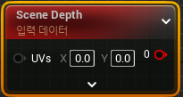
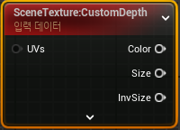

# Depth 머티리얼 표현식

* `렌더링되는 픽셀의 깊이를 다루는 머티리얼 표현식`

## DepthFade

* `반투명 오브젝트와 불투명 오브젝트가 겹칠 때 일어나는 이음새를 감추는 데 사용`

### 입력

* `Opacity` : DepthFade 전 오브젝트에 대한 기존 불투명도

* `Fade Distance` : 페이드가 발생하기 시작하는 월드 스페이스 상의 거리

## PixelDepth

* `현재 렌더링되고 있는 픽셀의 뎁스 또는 카메라에서의 거리를 출력하는 머티리얼 표현식`

 

## SceneDepth

* `기존의 씬 깊이를 출력하는 머티리얼 표현식`

*  PixelDepth 와 비슷하나, PixelDepth 는 현재 그려지고 있는 픽셀의 깊이만 샘플링할 수 있는 반면, SceneDepth 는 어느 위치의 깊이도 샘플링할 수 있습니다.
*  

 

## CustomDepth

*  `화면에 보이는것과 상관없이 카메라와 물체 사이의 거리`

*  SceneTexture을 생성한 후 Scene Texture ID에서 CustomDepth를 선택하면 된다.

