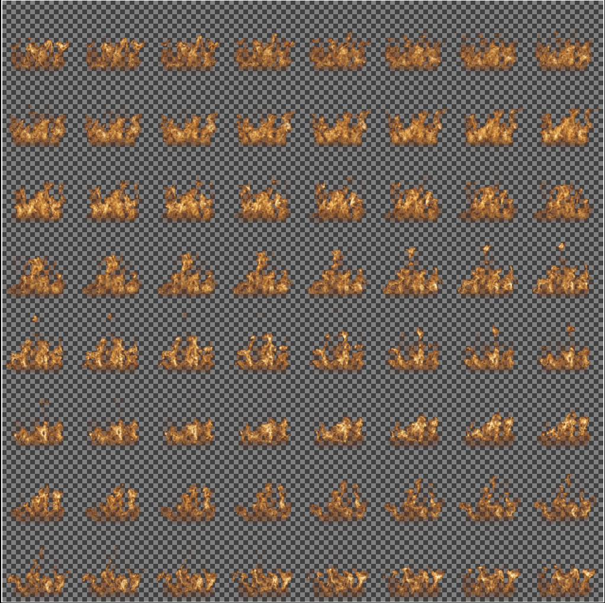
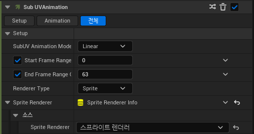

# Sub UV Animation

* 여러 개의 그림이 같은 크기로 있는 텍스쳐에 사용하기 위한 모듈

* Particle Update에서 추가할 수 있다.

 

# 예시 사진

* 가로로 8개, 세로로 8개의 그림이 있는 텍스쳐.

# 과정

### 1.Sprite Render

* `Render에서 Sprite Render를 추가`한다.
  
* 그 다음 `Material에 사용할 UV Texture를 넣어주고` Detail에서 `Sub Image Size`에서 가로,세로로 자를 개수를 적어준다.

### 2.Sub UV Animation

* `Particle Update에서 Sub UV Animation을 추가`한다

* Detail에서 `Source에서 Sprite Render를 추가`하고 맨 위에 Start Frame과 End Frame을 지정해준다.

  * 위 사진은 8*8 형식의 텍스쳐이므로 0 ~ 63 (총 64개)로 짤라서 사용한다.
  * 더 빠르게 재생하기 위해선 배수로 늘려주면 된다 (64개이므로 0~127 등)

