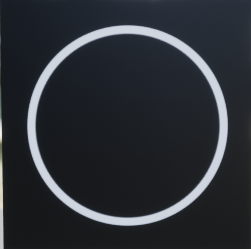
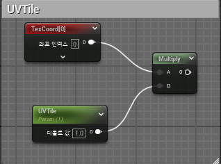
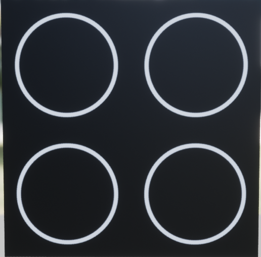
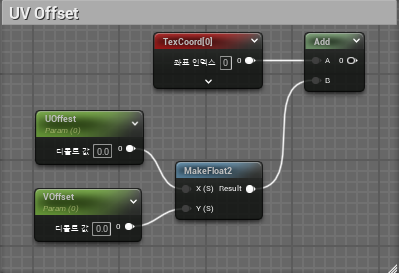
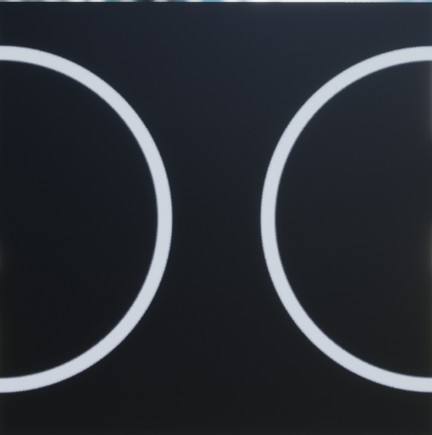
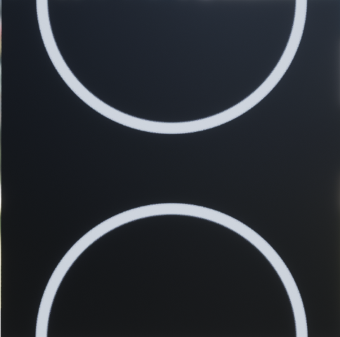
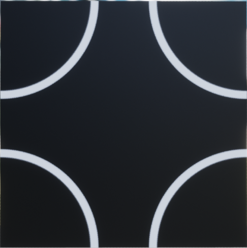

# UV 채널

* 스태틱 메시 내 데이터 세트로, 각 `메시의 버텍스를 2D 스페이스 좌표에 매핑한다`

* U는 텍스쳐의 가로축, V는 텍스쳐의 세로축을 가리킨다

* 텍스처 좌표는 `보통 0~1 사이로 유지`되며 `(0,0)은 텍스처의 왼쪽 하단`을 나타내고 `(1,1)은 오른쪽 상단`을 나타낸다.

* U 또는 V 의 값이 1 초과, 0 미만 경우, 텍스쳐의 다른 면을 래핑하게 된다

  * 예를 들어 V의 값 1.25는 0.25로 취급된다.

# 머티리얼에서 UV 조절하기

### 기본 텍스쳐

* 먼저 사용할 기본 텍스쳐는 다음과 같다

 

# UVTile

* UVTile은 `TexCoord(텍스쳐 좌표)`를 임의의 값을 곱해서 확대,축소를 할 수 있는 개념이다
  

 

* 기본적인 TexCoord의 범위는 0 ~ 1인데 곱하기2 를 하면 0 ~ 2가 된다

* UVTile 값이 2가 되면 다음과 같이 된다

 

# UVOffset

* UVOffset은 U 혹은 V의 값을 조절하여 텍스쳐를 움직이는 개념이다

 

* U가 0.5, V는 0일 경우 (가로 이동)

* U가 0, V가 0.5일 경우 (세로 이동)

* U가 0.5, V가 0.5일 경우 (가로, 세로 둘 다 이동)

