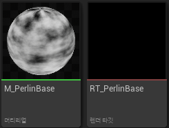
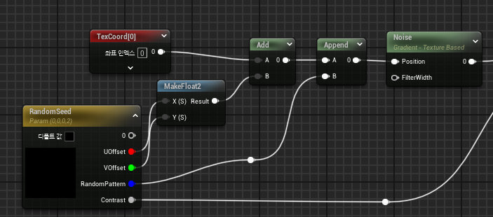
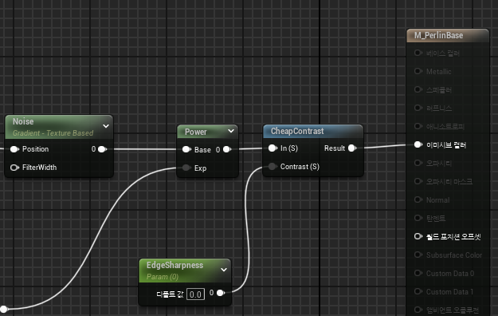
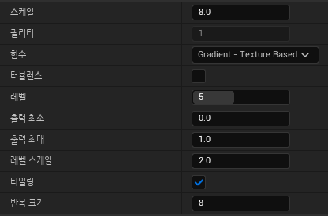
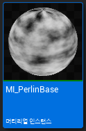
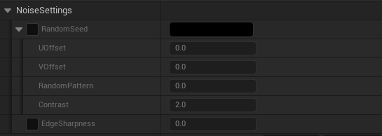
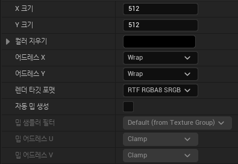

* 랜덤으로 Noise Texture를 만들기 위한 방법

* 이 장에서 만드는 Noise는 `Perlin Noise`라 한다.

 

## Material, RenderTarget 생성

* 먼저 사용할 `Material`과 `Render Target`을 생성해준다.

* 그리고 셰이딩 모델은 `unlit`으로 설정한다

## Material 그래프

* 언리얼에서 제공하는 Noise Node를 사용하여 임의의 Noise값들을 생성

* RandomSeed는 float4 파라미터를 통해서 생성된 Noise를 조절

 

* CheapConst과 EdgeSharpness 파라미터는 선명도를 조절하기 위해 사용

 

## Material Node들 설정

* 그다음 Material 에서 `우클릭 -> Noise`로 Noise Node를 생성하고 클릭해서 다음과 같이 설정한다

  * 타일링은 True, 터뷸런스는 False
  * Scale은 노이즈 셀의 크기를 결정하는 값으로, Repeat Size와 동일하게 맞춰준다
  * Levels는 흐릿함 정도를 나타내는 값
  * Output Min,Max는 UV와 맞춰주기 위해 0, 1로 설정

 

## Material Instance 생성

* Material의 Instance를 생성한다

 

* 그러면 파라미터값을 조절해서 원하는 Noise Texture를 만들 수 있다.

* 이 Noise를 Texture로 만들려면 Baking을 해야 하는데 그 전에 RenderTarget 설정부터 한다.

 

## RenderTarget 설정

* 처음에 만들었던 `RenderTarget`의 디테일에서 다음과 같이 변경한다
  * X크기 ,Y크기는 사용할 텍스쳐 크기로 원하는 크기로 조절한다
  * 렌더 타겟 포맷을 `RTF RGBA8 SRGB`로 바꿔준다.

 

## Baking

* 나중에..