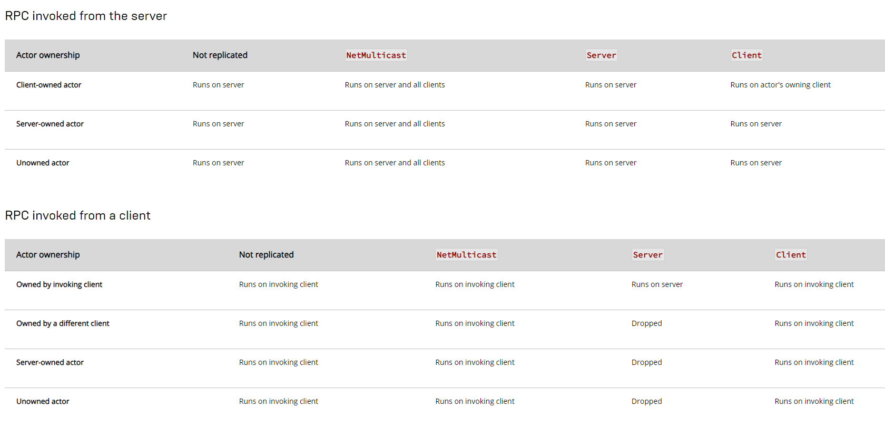

**RPC**
==========

* `로컬에서 호출되지만 다른 머신에서 원격 실행되는 함수를 의미한다`

* RPC를 사용하려면 UFUNCTION()에서 다음과 같이 키워드를 붙여주면 된다.


### Client

```c++
UFUCNTION(Client)
void ClientRPCFunction();
```

* 이 함수는 서버에서 호출되지만 클라이언트에서 실행된다.

### Server

```c++
UFUCNTION(Server)
void ClientRPCFunction();
```

* 이 함수는 클라이언트에서 호출되지만 서버에서 실행된다.

### NetMulticast

```c++
UFUCNTION(NetMulticast)
void ClientRPCFunction();
```

* 서버에서 호출되지만 서버와 모든 클라이언트에서 실행된다.

* 클라이언트에서도 호출이 가능하지만 그 경우에는 로컬에서만 실행된다.


<br>

**InVoke**
=========

* 클라이언트나 서버에서 RPC가 호출되면 어떻게 작동하는지는 공식 문서에 나와 있다.


<center></center>


<br>

**예시**
===========

* E키를 누르면 Combat이라는 ActorComponent에서 현재 충돌중인 Weapon을 장착하는 함수를 다음과 같이 만들었다고 한다.

```c++
void ABlasterCharacter::EquipButtonPressed()
{
	if(Combat)
	{
        Combot->EquipWeapon(OverlappingWeapon);
    }
}
```

* 서버와 클라이언트에서 각각 실행되면 서버에서는 장착되면 서버와 클라이언트 둘 다 보이지만,<br>
  클라이언트에서 장착하면 서버에서는 해당 클라이언트가 장착되지 않게 보인다.

### 서버에서 장착

<center></center>


* 서버캐릭터가 장착하면 클라이언트, 서버 둘 다 장착하는 모습

### 클라이언트에서 장착

<center></center>


* 클라이언트 캐릭터가 장착하면 서버(에디터)에서는 클라이언트 캐릭터가 장착하지 못한 모습

<br>

--------

* 위와 같은 상황을 해결하려면 RPC를 사용해야 한다.

* 헤더파일

```c++
// 클라이언트에서 호출되지만 서버에서 실행되도록 Server 키워드
// 확실하게 실행되려면 Reliable 키워드 사용
UFUNCTION(Server, Reliable)
void ServerEquipButtonPressed();
```

* 소스코드

```c++
// RPC함수는 _Implementation가 뒤에 붙어야 한다.
void ABlasterCharacter::ServerEquipButtonPressed_Implementation()
{
	if(Combat)
	{
		Combat->EquipWeapon(OverlappingWeapon);
	}
}

void ABlasterCharacter::EquipButtonPressed()
{
	if(Combat)
	{
		if(HasAuthority())	// 서버에서 호출
			Combat->EquipWeapon(OverlappingWeapon);
		else				// 클라이언트에서 호출
		 	ServerEquipButtonPressed();
	}
}
```

* HasAuthority라면 서버에서 호출되는 것이니 그대로 사용하고 <br>
  else면 클라이언트에서 호출되니 RPC를 이용하여 Server에서 실행되도록 하게 만들면 된다.

### RPC 적용

<center></center>


