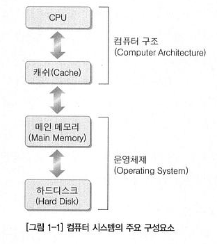
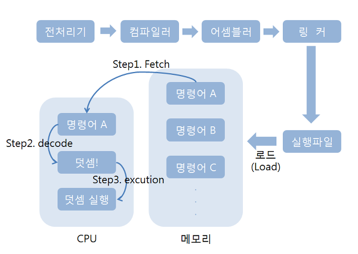

컴퓨터 시스템의 주요 구성요소  
============
 * 컴퓨터 시스템을 구성하는 요소는 아래와 같다.  
 
 &nbsp;&nbsp;&nbsp;&nbsp;&nbsp;&nbsp;&nbsp;
 

 

   

컴퓨터 하드웨어의 구성  
=====================
 

   

 * CPU
   * 중앙처리장치로써, 기본적으로 연산을 담당한다.
   * CPU의 내부에는 위 그림과 같이 ALU , 컨트롤유닛 , 버스인터페이스 , 레지스터가 있다.
  
 * 메인메모리
   * 램이라고도 부르는 메인메모리는 컴파일이 완료된 프로그램 코드가 올라가서 실행되는 영역이다
  
 * 입출력 버스
   * 입출력버스는 컴퓨터를 구성하는 구성요소 사이에서 데이터를 주고받기 위해 사용되는 경로다.
   * 데이터의 종류와 역할에 따라 여러가지 버스가 있다.
  
  

CPU에 대한 이해
===============
위의 그림과 같이 CPU 안에 여러가지 요소가 있다.
 * ALU
   * ALU는 CPU 내부에서 실제 연산을 담당하는 블록이다.
   * ALU가 처리하는 기본적인 연산은 크게 두가지로 나뉜다
     * 1.덧셈이나 뺄셈과 같은 산술연산
     * 2.AND나 OR과 같은 논리연산
  

 * 컨트롤유닛
   * CPU가 처리해야할 명령어들을 해석하고 해석된 결과에 따라 적절한 신호를 CPU의 다른블록에 전송한다.
  

 * 레지스터
   * CPU안의 아주 작은 메모리
   * CPU 내부에 여러개가 존재하며 CPU의 종류에 따라 개수와 형태가 다양하다.
  
 * 버스 인터페이스
   * 컴퓨터의 여러부품들끼리 데이터를 동작하면서 주고받는데 그 매개체 역할을 해주는게 I/O 버스
   * CPU 내에 I/O 버스의 통신방식을 이해해서 매개체 역할을 하는 것이 버스 인터페이스
   * CPU 내부에 (레지스터에)저장돼 있는 데이터를 I/O버스에 송수신을 한다.
  
 * 클럭 신호
   * 메모리와 CPU의 속도 차이로 인해서 이를 맞춰주기 위해서이다.
   * 클럭발생기에 의해 발생되는 클럭 신호는 CPU를 구성하는 요소 요소에 제공되며, 이 신호에 맞춰 CPU가 일을 한다.
   * 만약 입/출력장치의 속도가 다르다고 할 때 입력보다 출력이 빨라 입력전에 있던 값을 출력하는 경우가 발생
   

프로그램 실행과정
==================

  

 * 단계 1 : 전처리기에 의한 치환작업
   * #include,#define과 같이 #으로 시작하는 지시자의 지시에 따라서 소스코드를 적절히 변경
  

 * 단계 2 : 컴파일러에 의한 번역
   * 컴파일러에 의해서 어셈블리 코드로 번역된다.
   * 어셈블리 코드란 CPU가 디자인될 때 CPU에게 일을 시키기 위한 명령어도 같이 디자인되는데 이 명령어를 조합해서 만들어진 프로그램 코드를 의미한다.
  

 * 단계 3 : 어셈블러에 의한 바이너리 코드
   * 어셈블리코드를 바이너리코드(0과 1만으로 구성된 코드로)로 번역한다.
   * 컴퓨터는 0과 1만으로 이해하기 떄문.
  
 * 단계 4 : 링커에 의한 연결과 결합
   * 프로그램 내에서 참조하는 함수나 라이브러리들을 하나로 묶는 작업
   * 이 과정이 끝나면 실제로 실행 가능한 실행파일이 생성된다.(바이너리코드로 구성된 실행파일)
  

이렇게 만들어진 최종 실행파일은 컴퓨터에게 일을 시키기 위한 명령어가 들어가 있고  
메모리 공간에 올라가고 난 다음 CPU에 의해서 실행된다.  
  
이 밑에는 메모리 공간에 올라가고 나서의 과정이다.  
  
 * 단계 1 : Fetch
   * 메모리상에 존재하는 명령어를 CPU로 가져오는 작업이다.
  
 * 단계 2 : Decode
   * 가져다 놓은 명령어를 CPU가 해석하는 단계이다
  
 * 단계 3 : Execution
   * 해석된 명령어의 명령대로 CPU가 실행되는 단계

   

하드웨어 구성의 재접근
=======================
*  1. 명령어 실행을 위해서 제일 먼저 하는일이 Fetch인데 어떠한 이동 경로를 통해서 명령어의 Fetch가 진행되는가? 
   * 버스 시스템
  
 * 2. 명령어를 CPU안에 가져다 놓을 때 어디에 저장하는가?
   * 명령어를 저장하기위한 레지스터
  
 * 3. CPU 안에 가져다 놓은 명령어는 Decode 단계에서 해석되는데, 이는 CPU 안에 존재하는 누구에 의해서 진행되는가?
   * 컨트롤 유닛
  
 * 4. 마지막 단계인 Execution은 누구에 의해서 진행되는가?
   * 명령어를 통해서 요구하는것은 형태가 다양하지만 산술 및 논리연산으로써는 ALU
  
   

버스 시스템
===============
 * 데이터를 이동하는데에 있어서 사용되는 전송 경로를 가리켜 버스시스템이라고 한다.
 * 데이터의 종류에 따라서 어드레스버스, 데이터버스, 컨트롤 버스가 있다.
  
 * 버스의 종류
   * 데이터 버스
     * 데이터를 이동하기 위해 필요한 버스,데이터란 명령어나 피연산자를 의미
   * 어드레스 버스
     * 주소값을 이동하기위한 버스
   * 컨트롤 버스
     * CPU와 메모리가 서로 특별한 사인을 주고받는 용도로 사용되는 버스
     * CPU는 메모리부터 데이터를 받거나 메모리에 데이터를 저장하기도 하는데 이 때 주소나 값을 저장하거나 송/수신할때의 신호를 위해 사용한다.

      
출처: 뇌를 자극하는 윈도우즈 시스템 프로그래밍