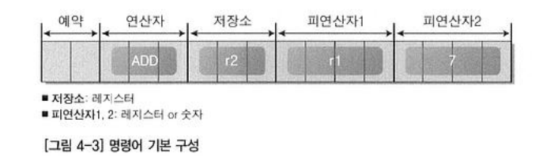
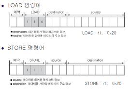

프로그래머 관점
========================
* 컴퓨터 구조를 잘 아는 프로그래머도 컴퓨터 디자인에 참여
* 프로그래머의 디자인은 레지스터와 명령어 디자인

<br>

레지스터
============================
* 레지스터 디자인
  * 레지스터를 몇비트로 구성할지
    * n비트 시스템에서의 명령어 길이도 n비트이고 레지스터도 n비트여야 하나의 명령어를 저장.
  * 몇 개 정도로 레지스터를 구성할지
  * 레지스터를 각각 무슨 용도로 사용할지
    * 레지스터의 용도를 정하면 명령어가 단순해지고 속도가 빨라짐.

<br><br>

* 레지스터 구조

<br>

<p align="center"></p>

<br>


명령어
================================


* 명령어 구조
  * 레지스터 구성형태에 따라 명령어 구조가 달라진다.
  * 명령어를 비트값에 따라 디자인한다면 16비트로는 2의 16승인 65536개를 만드는 비효율적인 상황이 나옮.

<br><br>


<p align="center"></p>


* 명령어 예시
  * 레지스터r1에 있는 값과 숫자 7를 더해서 레지스터r2에 저장하라
  * 피연산자
    *  레지스터 정보나 숫자만 올 수 있음
    *  맨 앞의 비트는 레지스터나 숫자를 구분하는 비트
   * 첫번째 피연산자 위치에는 레지스터 이름이 와야한다라는 제약사항이 있음

<br><br>

* 명령어의 제약사항
  * 위에서 처럼 명령어를 디자인하는 과정에서 제약사항이 생긴다.
  * arm이나 x86 계열의 어셈블리 프로그래밍에서도 첫번째 피연산자 위치에는 레지스터 이름이 와야한다라는 제약사항이 있다.
    * 이러한 제약사항들은 CPU의 종합적 측면(성능,비용)이 고려되는 가운데서 생겨남
  

<br><br>

RISC vs CISC
======================
* 명령어 구성에 제약사항이 항상 따르진 않음.


* CISC
  * 장점 : 명령어 종류가 많고 다양한 조합이 가능하다
  * 단점 : 명령어 수가 많고 크기가 일정치 않기 때문에 복잡해지고 복잡해진 구조는 성능 향상에 제한이 생김
  * 16비트에서 사용


* RISC
  * CISC에서 명령어 수를 대폭 줄이고 명령어 길이를 일정하게 디자인한 구조
  * 32비트, 64비트 , 임베디드에서 사용
  * 초당 클럭수를 높이고, 명령어 길이와 처리가 일정하기 때문에 클럭당 처리할 수 있는 명령어의 개수가 늘어나면서 성능 향상이 됨

<br><br>

LOAD & STORE
===============================
1. 연산결과를 레지스터에만 저장할 수 있다는 제약사항이 있기 때문에 메인메모리의 주소값을 통한 사칙연산이 불가능하다  
2. 따라서 메인 메모리에 저장된 데이터를 레지스터로 옮기고, 덧셈을 진행해야 한다.  
3. 그러기 위한 명령어가 필요하다

<br>

* LOAD
  * 메인 메모리에 저장된 데이터를 레지스터로 이동시키기 위한 명령어
* STORE
  * 레지스터에 저장된 데이터를 메인 메모리로 이동시키기 위한 명령어

<br><br>


<p align="center"></p>


* LOAD r1 0x20
  * 0x20번지에 있는 값을 레지스터 r1에 저장

* STORE r1 0x20
  * 레지스터 r1에 있는 값을 메인 메모리 0x20번지에 저장
  

<br><br>

* 예시  

```c++
int a = 10; // 0x10 번지 할당
int b = 20; // 0x20 번지 할당
int c = 0; // 0x30 번지 할당
c = a + b; 

명령어 순서
LOAD r1, 0x10  
LOAD r2, 0x20  
ADD r3, r1, r2
STORE r3 , 0x30
```


<br><br>

Direct 와 InDirect
===================
1. 하나의 명령어에 여러 정보를 담다보니 표현하는 데이터 크기에 제한이 따른다는 문제점이 있다.
2. 그 이유는 할당된 비트 수 안에서 표현 가능한 범위의 메모리만 접근이 가능하기 때문 (Direct모드)
3. 이러한 문제를 해결하기 위해 InDirect모드를 사용한다

<br><br>

* Direct 모드
  * 메모리의 주소값을 직접 표현
* InDirect모드
  * 명령어에서 지정하는 번지에 지정된 값을 주소값으로 참조


