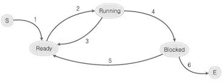

프로세스의 이해
=========================

* 프로세스
  * 실행 중에 있는 프로그램을 의미
  * 크롬의 실행파일 Chrome.exe은 프로그램이고 이 프로그램을 실행시켜 보게되는 창은 프로세스가 된다

  

* 프로세스를 구성하는 요소
  * 메모리 공간
    * Data 영역 : 전역변수,static 변수를 할당하는 메모리 영역
    * Stack 영역 : 지역변수 할당과 함수 호출시 전달되는 인자값들을 저장하는 메모리 영역
    * Heap 영역 : 동적할당(malloc,new)을 받는 메모리 영역
    * Code 영역 : 실행파일을 구성하는 명령어들이 올라가는 메모리 영역

    * 프로그램 실행시 만들어지는 메모리구조도 프로세스라고 한다.
  * 레지스터 구성
    * 프로세스가 실행되면 레지스터들도 필요한 데이터로 채워진다
    * 따라서, 레지스터들의 상태도 프로세스의 일부로 포함시켜 말할 수 있다.

  

프로세스의 스케줄링과 상태 변화
============================
 CPU는 하나인데 어떻게 여러개의 프로그램이 동시에 실행가능한 이유는 스케줄링 때문이다.
 
   

* 프로세스 스케줄링
  * 하나의 CPU가 여러개의 프로세스들에 CPU 할당 시간을 나눠서 실행
  * CPU가 매우 빨라서 동시에 실행시킨다고 느껴짐.

  

* 스케줄링의 기본 원리
  * 프로세스들에게 CPU를 할당하는 기준이 중요하다
  * 프로세스의 CPU 할당 순서 및 방법을 결정짓는 일을 스케줄링이라고 한다
  * 이 때 사용되는 알고리즘을 가리켜 스케줄링 알고리즘이라고 한다.
  * 스케줄링 알고리즘을 적용해서 실제로 프로세스를 관리하는 운영체제 요소(모듈)을 가리켜 스케줄러라고 한다.

  

* 프로세스들이 실행되는 형태
  * 고전 방식은 실행해야 할 일을 순차적으로 실행
    1.  A프로세스 실행
    2.  A프로세스가 종료되면 B프로세스 실행
    3.  B프로세스가 종료되면 C프로세스 실행    
  
  * 멀티 프로세서 기반은 동시에 실행되는 형태
    * A,B,C 프로세스를 모두 실행후, 멀티 프로세스 운영체제의 스케줄러에 의해서 프로세스들이 관리된다.

  

* 멀티 프로세스 운영체제가 효율적인 이유
  * 일반적으로, 프로그램이 실행되는 과정에서 많은 시간을 I/O에 할당한다.(I/O는 입력과 출력 , 네트워크와 호스트사이 데이터 송수신등을 의미)
  * 고전방식이라면 프로세스가 I/O관련 작업을 하고있다면 CPU는 아무일도 하지 못함
  * 멀티 프로세서 기반은 프로세스가 I/O관련 작업도중이라면 다른 프로세스를 실행되도록 스케줄링을 시켜 CPU가 계속 일을 한다.

프로세스의 상태 변화
============================

여러 프로세스가 돌아가면서 실행되기 때문에, 프로세스의 각각의 상태는 시간 흐름에 따라 변화한다

*  S(Start)에서 Ready 상태로의 전이
    * S는 프로세스가 생성되었음을 의미
    * 프로세스는 생성과 동시에 Ready 상태
    * Ready상태에 있는 프로세스는 CPU(스케줄러)에 의해 실행을 기다리는 상태

   

* Ready 상태에서 Running 상태로의 전이
    * 스케줄러는 Ready 상태에 있는 프로세스중 하나를 선택해서 CPU에 의해서 실행되도록 한다.
    * 선택된 프로세스는 Ready상태에서 Running 상태가 되어 실행

  
    
* Running 상태에서 Ready 상태로의 전이
    * 프로세스들은 생성 시 중요도에 따라서 우선순위가 매겨진다
    * 실행중인 프로세스보다 우선순위가 높은 프로세스가 있을 경우, 실행중인 프로세스는 Ready가 되고 우선순위가 높은 프로세스는 실행된다.

  

* Running 상태에서 Blocked 상태로의 전이
    * 실행중에 있는 프로세스가 실행을 멈추는 상태 , 일반적으로 데이터 입,출력 관련된 일을 하는경우에 발생한다
    * 데이터 입출력동안에는 CPU에 의해 프로세스가 더이상 실행될수 없어서 Blocked상태로 만들고 Ready 상태에 있는 프로세스 중 하나를 대신 실행시키는 것이 효율적이다.

  

* Blocked 상태에서 Ready 상태로의 전이
    * Blokced 상태는 스케줄러에 의해서 선택될 수 없는 상태
    * 입출력이 완료된 Blocked 프로세스는 Ready  상태가 되어 스케줄러를 기다린다.

  

* Ready와 Blokced의 차이점
  * Ready 상태 스케줄러에 의해 선택되어 지금 당장이라도 실행 가능한 상태
  * Blocked 상태는 스케줄러에 의해서 선택될 수 없는 상태

  

# 컨텍스트 스위칭(Context Switching)

멀티 프로세스 운영체제가 여러 장점이 있지만 실행중인 프로세스를 변경하는건 시스템에 많은 부하를 가져다 준다.

이유는 <mark style='background-color: #ffdce0'>CPU 내에 존재하는 레지스터들은 현재 실행 중에 있는 프로세스 관련 데이터들로 채워지기 때문에 변경시 레지스터의 값들을 변경</mark>해야 하기 때문이다.

즉 컨텍스트 스위칭이란 <mark style='background-color: #ffdce0'>여러 프로세스를 실행하고 있는 상태에서 인터럽트 요청에 의해 기존의 프로세스의 상태 또는 레지스터 값(Context)을 저장하고 CPU가 다음 프로세스를 수행하도록 새로운 프로세스의 상태 또는 레지스터 값(Context)를 교체하는 작업</mark>이다

