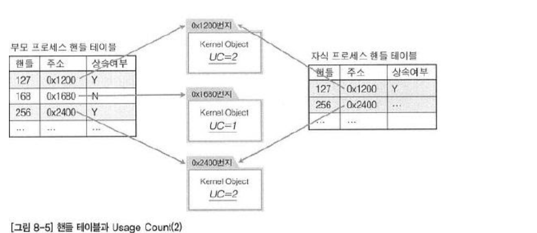

핸들 생성 과정
====================

* 메일 슬롯으로 핸들 생성하는 과정

 

 * 0x2400번지에 메일슬롯 정보를 저장하는 커널 오브젝트가 생성  
 * 256은 커널 오브젝트를 가리키는(지시하는) 용도로 사용되는 핸들  
 * 핸들 256을 통해서 0x2400번지에 할당되어 있는 메일슬롯에 접근이 가능하다. 
   * 그런데 위의 그림을 보았을 때 핸들 256이 0x2400번지에 존재하는 커널오브젝트를 의미한다는 정보가 없다.
   * 그러한 정보들은 사실 핸들이 가리키는 핸들테이블에 저장되어 있다.

  

핸들 테이블
====================

* 핸들 테이블이 포함된 생성 과정

 

* 핸들 테이블에 등록되어 있는 데이터들로 핸들256에 주소 0x2400번지가 저장되었음을 알 수 있다.
  
 

* 프로세스가 함수 호출을 통해서 리소스 생성을 요구한 결과로 핸들 정보를 얻을 경우, 
  프로세스 자신에게 속해 있는 핸들 테이블에 해당 정보가 등록된다.

 

* 핸들 테이블
  * 핸들 정보를 저장하고 있는 테이블로서 프로세스별로 독립적이다.
  * 각각의 프로세스가 자신만의 핸들 테이블을 하나씩 구성하고 관리한다.

  

핸들의 상속
===============

* CreateProcess 함수를 호출하면 자식프로세스가 생성되고 자식 프로세스의 핸드 테이블도 생성한다.

* CreateProcess 함수 호출시 전달되는 인자가 무엇이냐에 따라 부모 프로세스의 핸들 정보는 자식프로세스에게 상속될 수 있다.
  * 자식 프로세스는 부모 프로세스의 핸들 테이블에 등록돼 있는 핸들을 상속받을 수 있지만, 필연적으로 상속받는 것은 아니다.

 

* 상속 여부에 따른 핸들의 상속

* 자식 프로세스가 부모 프로세스로부터 상속받은 핸들은 상속 여부에 대한 정보도 변경없이 상속된다.
  * 위의 그림과 같이 자식에 상속받은 핸들들은 부모의 상속여부를 그대로 상속받았다.

  

핸들의 상속과 커널 오브젝트의 Usage Count
==================

 * 핸들과 UsageCount관계
    1. 커널 오브젝트를 참조하는 프로세스 개수만큼 커널 오브젝트의 Usage Count는 참조(공유)하는 프로세스의 수만큼 증가한다.  
    2. 그렇다면 커널 오브젝트를 참조하는 프로세스가 되기 위한 조건은 무엇인가? 
    -> 핸들을 얻은 프로세스가 커널 오브젝트를 참조하는 프로세스가 된다.  
    1. 프로세스가 핸들을 얻게 된다는 것은 무엇을 의미하는가? 
    -> 프로세스가 핸들을 얻게 되었다는 의미는 핸들 테이블에 해당 핸들에 대한 정보가 갱신(추가) 되었음을 의미한다. 

   

* CreateMailSlot함수의 호출을 통한 메일슬롯의 예시
  * 과정
  1. 메일슬롯 리소스 생성
  2. 커널 오브젝트 생성
  3. 핸들 정보가 핸들 테이블에 갱신
  4. CreateMailSlot함수를 빠져 나오면서 핸들값 반환

 

* 프로세스가 핸들을 얻게 되었다고 한다면, 4번째에 초점을 맞추지만 실은 3번째에서 프로세스가 핸들을 얻게 되었다고 말할 수 있다. 
* 즉, 핸들 테이블에 핸들에 대한 정보가 등록되면, 그 순간 핸들을 얻었다고 말할 수 있다.

    

* 핸들 테이블과 Usage Count(1)

* UC (Usage Count)를 보면 부모 프로세스의 핸들 테이블에만 핸들 정보가 등록 되어 있는 관계로 1로 되어 있다.
* CloseHandle를 호출한다면 UC가 0이 되면서 해당 커널 오브젝트와 리소스는 소멸된다.

    

* 핸들 테이블과 Usage Count(2)

* 자식프로세스를 생성하면서 상속했더니 핸들정보가 갱신되면서 UC가 2가 된 모습이다.

  

상속이 되기 위한 핸들의 조건
===================================

* 핸들의 상속 여부는 리소스가 생성되는 순간에 프로그래머에 의해서 결정된다

        // 메일 슬롯의 예시
        HANDLE CreateMailslot(
        LPCTSTR lpName,                
        DWORD nMaxMessageSize,          
        DWORD lReadTimeout,           
        LPSECURITY_ATTRIBUTES lpSecurityAttributes, // 핸들 상속 여부
        };
        

* CreateMailSlot에서는 4번째 인자를 통해서 상속여부를 결정할 수 있다.
  * LPSECURITY_ATTRIBUTES는 SECURITY_ATTRIBUTES 구조체의 포인터타입이다.
  * 이 값에 NULL이 들어가면 전달되지 않고,구조체 변수의 주소값을 전달하면 상속될 수 있다.  
* 대부분의 리소스 생성방식에 위와 같이 구조체의 멤버를 통해서 상속여부를 결정할 수 있다.
       

  

Pseudo 핸들과 핸들의 중복
==========================

* 현재 실행 중에 있는 프로세스 자신의 핸들을 얻는 방법으로써 GetCurrentProcess 함수가 있다.

> 이 함수를 통해 얻은 핸들을 가리켜 가짜 핸들(Pseudo 핸들)이라 한다.

> 이렇게 얻은 핸들은 핸들 테이블에 등록되어 있지 않은 핸들이고, 현재 실행 중인 프로세스를 참조하기 위한 용도로 정의해 놓은, 약속된 상수가 반환되기 때문이다.

> 따라서 자식 프로세스로 상속되지 않으며, CloseHandle함수를 사용할 필요가 없다.