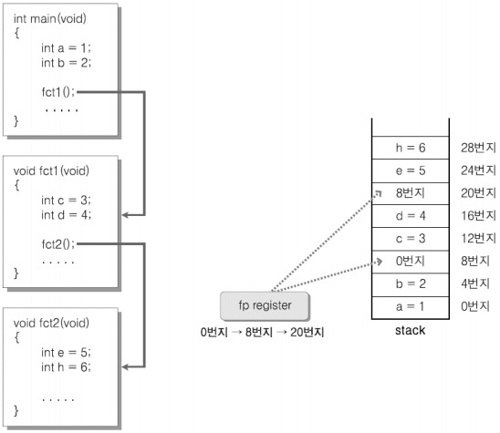
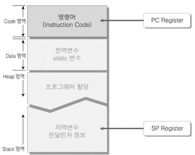

절차적 함수 호출(Procedure Call)지원 CPU 모델
========================

스택 프레임 구조
---------------

* 스택 프레임(Stack Framee) 구조

  *  함수 호출 과정에서 할당되는 메모리 블록 (지역 변수 선언으로 인해 할당되는 메모리 블록)

 

* 함수 호출이 완료되면 기존에 선언된 지역변수에 접근이 불가능 하다.

    * 할당되었던 메모리가 반환되었음을 의미

    * 함수가 반환되면 그 함수의 스택 프레임은 모두 반환된다.

   

sp 레지스터 
------------

* 지역 변수를 위한 메모리 공간을 스택이라 부르는 이유는 메모리의 구조적 특성(Last In, First Out)
  
  * 스택 프레임은 가장 먼저 할당되면,가장 나중에 반환되고 가장 나중에 할당되면 가장 먼저 반환된다.

 

* 스택에 데이터를 쌓거나 반환하기 위해 어느 위치까지 데이터를 저장했는지 기억해야만 한다

* 이를 위해 CPU 내에 sp라는 이름의 레지스터가 존재한다.

 

* sp 레지스터

    * 변수가 선언되면 현재 sp가 가리키는 위치에 할당하기 때문에 sp 위치를 아래로 이동시키는 것만으로도 이전에 선언된 변수를 반환할 수 있다.

      * 변수 할당 시 이전에 저장된 값들을 덮어 쓴다.

      * 때문에 sp가 가리키는 위치를 아래로 이동시키는 방식으로 스택 프레임을 반환한다.

   

* 그림

 

 

1. sp 레지스터값은 변수가 할당될 때마다 증가하면서 다음 변수가 할당될 메모리 위치를 가리킨다
   
    * stack에 변수 a,b,c 차례로 할당

 

2. 호출된 함수가 종료될 경우 스택 프레임 단위로 sp 레지스터 값을 이동시켜야 한다.(아래로)

    * 호출된 함수가 종료될 경우 그안에서 선언된 변수들을 동시에 모두 반환해야 하기 때문

  
  

* sp 레지스터의 문제점

    * 호출이 완료된 함수를 빠져 나오는 시점에서 함수 내에서 할당된 메모리 공간을 반환하기 위해 스택 프레임 단위로 sp를 아래로 이동시킬 때 얼마나 이동시켜야 하는지 모른다.

    * 프레임 포인터 레지스터(fp)가 이 역할을 수행한다.

   

프레임 포인터 레지스터
-------------

* 새로운 함수가 호출될 때마다 fp 레지스터값을 0으로 초기화한다.
  
* 그리고 그 변수가 선언될 때마다 그 크기만큼 값을 증가시킨다.

* 그런데 이 방법은 변수를 선언할 때마다 덧셈 연산을 해야만 한다.

  * 스택 연산에 드는 비용을 상당히 늘리는 결과를 초래

  

* 위와 같은 방법이 아니라 되돌아갈 sp의 위치만 저장

    * 결국 목적은 sp 위치를 함수 호출 이전으로 되돌리기 위해서 이므로 위치만 알면 된다.

 

* 되돌아갈 sp의 위치를 저장하는 레지스터를 가리켜 fp(Frame Pointer) 레지스터라고 한다.

   

* 다만, fp 레지스터의 등장으로 모든 문제가 해결되지 않는다.

  * ex) 함수 호출이 중첩되어 일어날 때

    * 새로운 함수의 스택 프레임 반환을 위한 주소값을 fp 레지스터에 저장하는 과정에서 fp 레지스터에 저장되어 있던  이전 함수의 스택 프레임 반환을 위한 주소값을 덮어 써버린다.

     

스택에 저장하자, 프레임 포인터
--------------
* 덮어쓰는 문제가 발생하기 전에, fp의 값을 어딘가에 저장해 두면 된다.

    * 즉 함수 호출이 일어날 때마다 fp 레지스터에 저장되어 있는 값을 스택에 저장한다.

    * 그리고 나서 새로운 값으로 fp 레지스터를 채운다.

  

* 그림

 

 

1. fct2 함수가 호출되기 직전에 sp 레지스터에는 주소값 20이 들어가 있다. 현재 스택 주소를 가리키는 것이다.

 

2. fct2 함수가 호출되기 직전에 fp 레지스터에는 주소값 8이 들어가 있다. main 함수나  fct1 함수의 경계에 해당하는 주소 정보이다.

 

3. fct2 함수가 호출되면서, fp 레지스터에 저장된 값 (주소값 8)을 현재 sp 레지스터가 가리키는 위치 20번지에 먼저 저장한다. 그 다음 fp 레지스터 값 20을 저장한다. 이 값은 fct1 스택과 fct2 스택의 경계가 된다.

 

4. 이후 fct2 함수 호출이 완료되어 반환하고자 한다면, fp 레지스터에 저장된 값을 참조해서 sp 레지스터 값을 20으로 변경한다. 이는 fct2 함수의 스택 프레임을 날리는 효과를 가져온다.

 

5. 현재 sp 레지스터가 가리키는 위치(주소 20번지) 에 저장되어 있는 값을 fp 레지스터에 옮겨다 놓는다. 이로써 fct1 함수 호출이 완료되는 상황에서 sp의 위치를 8번지에 가져다 놓을 수 있게 되었다. 이는 main 스택과 fct1 스택의 경계가 된다.

      

함수 호출 인자의 전달과 PUSH & POP 명령어 디자인
====================

함수 호출 인자의 전달 방식
---------------------------------

* 함수 호출시 전달되는 인자들은 어떻게 함수 내부로 전달되는가?

   * 함수 호출시 전달되는 인자들은 모두 스택에 저장한다.

   * 지역변수가 스택에 할당되는 방식과 동일하다.

 

* 그림

 

 

* function이 호출되면서 두 개의 숫자 7, 8이 전달되고 있다.

* 현재 sp가 가리키는 위치에 7을 저장하면서 sp을 증가시킨 다음, 다시 8을 저장하면서 sp값을 증가시키고 있다.

    

Push & POP 명령어 디자인
----------------

* sp가 가리키는 현재 위치에 전달되는 인자값을 저장하고 나서, sp를 증가시켜 다음 메모리를 가르키게 한다.

   

함수 호출(Procedure Call)에 의한 실행의 이동
============================

* 그림

 

 

* 프로그램 실행시 위와 같은 메모리구조가 형성된다.

* 코드 영역
  
  * 프로그램이 동작하기 위한 프로그램 코드(컴파일된 명령어들의 집합)가 올라가는 위치

  * 코드 영역에 실행되어야할 명령어들이 올라가서 순차적인 실행이 이뤄진다.
    
  * Fetch, Decode, Execution 이 세 단계 중  Fetch 단계가 명령어를 cpu 내부로 가져오는 단계인데, 이때 명령어를 가져오게 되는 위치는 프로그램 코드가 존재하는 코드영역이다.
  
  * 따라서 컴파일된 프로그램 코드가 코드 영역에 올라간 다음부터 명령어는 순서대로 Fetch, Decode, Execution되는 것이다.

 

* 명령어 길이가 4바이트라면, 그리고 실행중인 프로그램이 현재 1036번지에 있는 명령어라면, 다음번에는 1040번지에 있는 명령어가 Fetch 되어야 한다.

 

* 이 때, 어느 위치에 있는 명령어까지 가져와 실행했는지 기억해둬야 다음번에 실행할 명령어를 가져올 수 있다. 

  * 명령어를 순차적으로 fetch하기 위해 "pc 레지스터"를 둔다.

 

* pc 레지스터는 fetch 연산이 일어날 때마다 자동적으로 pc값이 증가한다.
우리가 직접 pc값을 컨트롤 하지 않아도 된다.

 

* 하지만, 필요에 따라 프로그램상에서 pc값을 직접 조절해야 하는 경우도 있다.

    

함수 호출과 함수 종료
--------------------

* 주제

  * 함수 호출시 실행위치의 이동은 어떻게 이뤄지는가?

  * 함수 호출이 끝나고 나면 어떻게 이전 실행위치로 복귀하는가?

 

* 그림

 

 

* 함수 호출이 발생할 때,그리고 호출된 함수에서 복귀할 때 특정 위치로의 이동이 가능도록 해야한다.

 

* 32비트 명령어 기준으로 pc는 명령어를 실행할 때마다 4씩 증가한다.

 

* 이 pc에 함수 호출로 인해 이동해야 할 주소값을 저장해 두면 자연스럽게 실행의 위치는 이동하게 된다.

 

* 그 전에, 현재 pc의 값을 백업하는 일이 필요하다.
  * 그렇지 않으면 함수 호출이 완료된 이후 돌아오는 길이 막연하다.

 

* 스택에 저장하는 수밖에 없다.  함수 호출 시 스택에 저장해야 할 대상이 늘어났다.
 

    

함수 호출 규약(Calling Convention)
=================

* 함수 호출 시 전달되는 인자가 왼쪽의 인자부터 시작해서 스택에 쌓이는 구조가 있으면 반대로 오른쪽 인자부터 시작해서 스택에 쌓이는 구조도 존재할 수 있다.

 

* 전달인자의 스택을 쌓는 방법에 두가지가 존재하듯이, 함수 호출과정에서 할당된 스택 프레임을 반환하는 방법에도 두가지가 존재한다.

  *  스택 프레임의 반환

      * 함수 호출이 완료된 이후의 동작을 의미

      * 주체는 호출자(Caller)가 될 수도 있고, 호출이 된 함수(Function)이 될 수도 있다.

 

* 이처럼 함수 호출시 인자를 전달하는 방식과 스택 프레임을 반환하는 방식을 약속해 놓은 것을 가리켜 함수 호출규약이라 부른다.

  

__cdecl,__stdcall + α
--------------

* 함수호출 규약을 지정하는 키워드

 

    #define CALLBACK __stdcall
    #define WINAPI   __stdcall

 

* 호출규약 선언이 존재하지 않은 함수는 프로젝트 속성창 -> C/C++ -> 고급 -> 호출 규칙을 디폴트로 선언한다.

    

호출규약의 종류와 의미
------------------------

 

* 32비트 기반 함수 호출규약

  * __cdecl은 C/C++의 디폴트 호출규약

  * 인자 전달방식은 C 언어 스타일로, 오른쪽에 전달되는 인자가 먼저 스택에 쌓이는 방식이다.

  * 반환 시에는 함수를 호출하는 호출자가 스택 프레임을 반환하도록 정의되어 있다.

  

* __stdcall와 __cdecl의 차이점은 스택 프레임을 반환하는 주체이다.

  * __stdcall은 호출된 함수 내에서 스택프레임을 반환하도록 정의되어 있다.

  

* _fastcall은 함수 호출을 빠르게 처리하기 위한 호출규약

  * 첫 번째 인자와 두 번째 인자는 레지스터의 사용유무를 설명한다. (Parameters in register)

    * 각 인자들은 레지스터 ecx와 dex를 통해 전달된다.

    * 여기서 ecx와 dex는 레지스터의 이름을 의미한다.

  

* 호출규약에서 레지스터를 사용함으로써 함수 호출이 빨라지는 근거가 된다.

  * 두 개를 넘어서면 인자에 대해서는 스택을 활용하게 된다.

  

* 64비트 기반 함수 호출 규약

  * 64비트 시스템에서는 함수 호출규약이 운영체제에 따라서 나뉘게 된다.

  * Windows 기반에서는 총 8개의 레지스터를 활용해서 전달되는 인자를 저장하게 되는데, 실제로 레지스터에 저장되는 전달인자의 개수는 4개에 지나지 않는다.

    * rcx/xmm0 : 첫 번째 전달인자가 rcx 혹은 xmm0 레지스터에 저장되는 것을 의미

    * 따라서 총 4개의 전달인자까지만 레지스터를 통해 처리한다.

  * 반면 Linux나 BSD 계열의 시스템에서는 훨씬 많은 수의 레지스터를 전달되는 인자에 할당하고 있음을 볼 수 있다.

    * 최대 14개의 인자까지 레지스터를 통해 처리한다.

 

    콜백(Callback) 함수란, Windows 시스템에 의해 자동으로 호출되는 함수를 의미한다.
    특정상황에서 호출되어야 할 함수를 등록시키는 것이 가능한데, 이때 등록이 되는 함수를 가리켜 콜백 함수라 한다.
    보통 UI와 관련된 API의 이벤트 핸들링 관련된 내용을 공부하면서 자주 접하게 된다.

 

